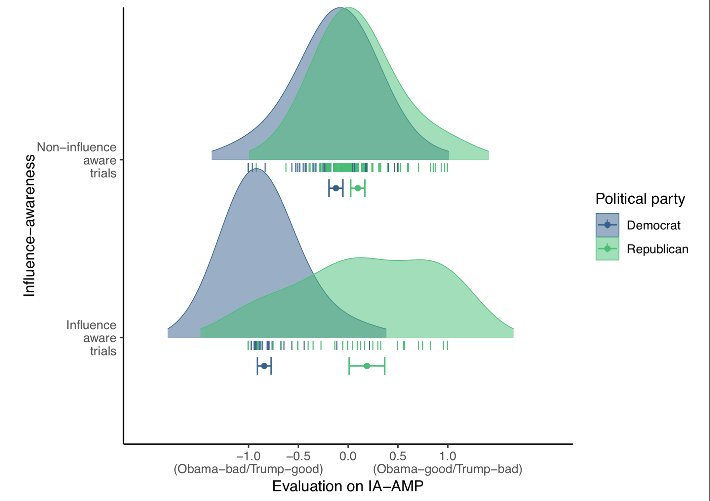
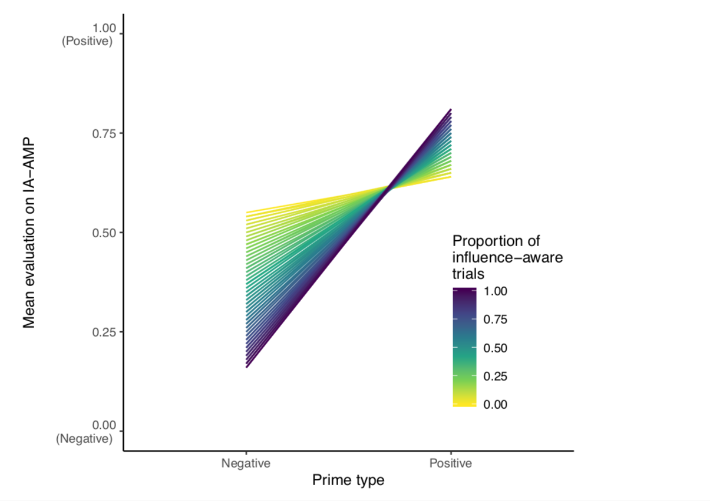
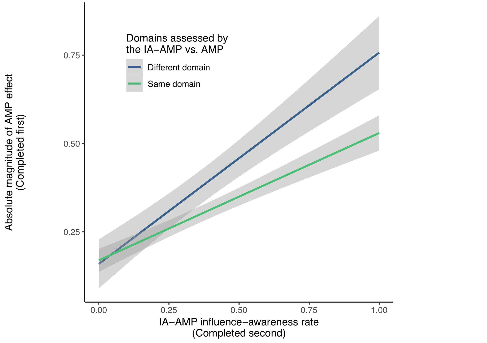
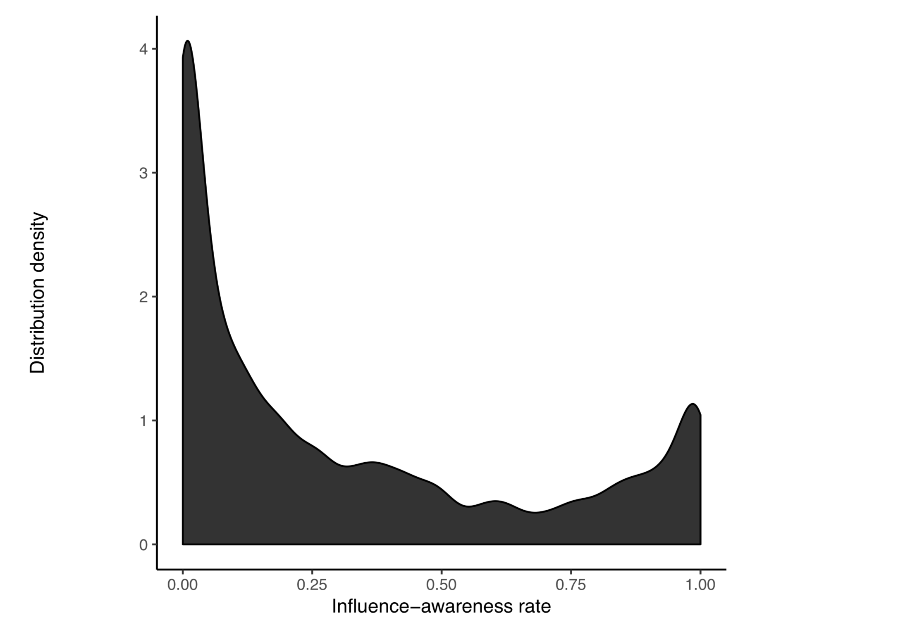
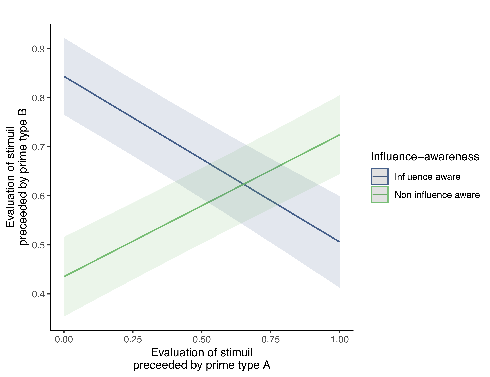
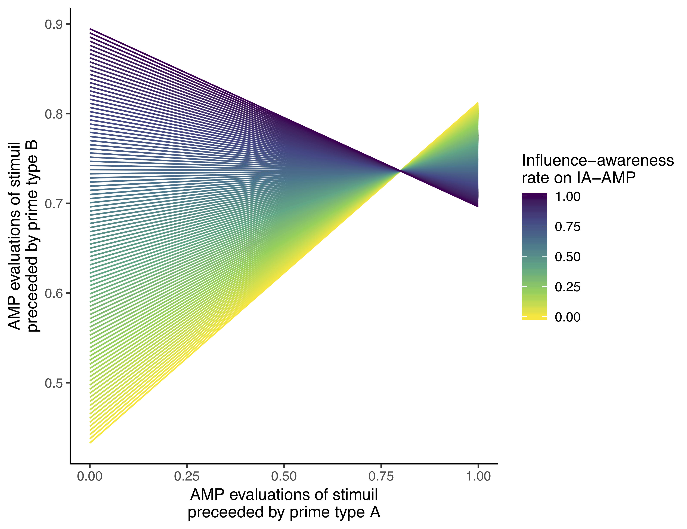

```{r, include=FALSE}
knitr::opts_chunk$set(echo = FALSE,
                      message = FALSE,
                      warning = FALSE)
```

# Introduction

Over the last twenty years research on implicit cognition has exploded from a relatively small area into, what is today, one of the most prolific and widely examined topics in psychological science. The idea that our automatic thoughts, feelings, and actions shape downstream behavior drives research, theory, and application throughout the discipline, particularly in social and personality psychology, neuroscience, health, cognitive, and clinical psychology (for a book length treatment see Gawronski & Payne, 2010). The success of the topic has in large part been due to the development and widespread use of procedures known as indirect measurement procedures. In contrast to direct measurement procedures, which simply ask people to directly report their thoughts, feelings, and actions, indirect measurement procedures seek to indirectly probe the mind by interpreting participants’ performance (e.g., speed and/or accuracy) on experimental paradigms. The outcomes of these measurement procedures are commonly referred to as implicit measures (De Houwer, 2006). Notable examples include the Implicit Association Test (IAT: Greenwald, McGhee, & Schwartz, 1998), evaluative priming tasks (Hermans, De Houwer, & Eelen, 1994), and approach-avoidance tasks (Rinck & Becker, 2007; for a review see Gawronski & De Houwer, 2014). Indirect measurement procedures are often deployed under the assumption that they limit a person’s ability to control how they respond, as well as the need for them to introspectively access, or be consciously aware of, the content under investigation. As a result, implicit measures have historically been used whenever researchers want insight into content that people may be unwilling or unable to report (see Greenwald et al., 1998; Hahn & Gawronski, 2019). Although debate continues about what implicit measures actually capture (Brownstein, Madva, & Gawronski, 2019), a vast and ever-increasing number of studies continue to rely on them to provide insights that self-reports cannot. 

## The Affect Misattribution Procedure 

The Affect Misattribution Procedure (AMP) has emerged as one of the more popular indirect measurement procedures because it possesses the structural advantages of sequential priming along with good psychometric properties (which priming and other reaction-time tasks often lack: see Payne & Lundberg, 2014). At its core, the AMP consists of a series of trials that are themselves comprised of three main components: a prime image (e.g., a racial group member) which is first flashed on screen for a brief period of time, followed quickly by a target image (usually a neutral Chinese symbol), which is subsequently masked by a white noise image. The AMP requires participants to subjectively evaluate how visually pleasing the ambiguous target image (Chinese character) is, while ignoring the prime image which preceded it. Despite being explicitly told to disregard the prime when evaluating the target, people nonetheless evaluate the target image in ways that are consistent with the valence of the prime that preceded it. For instance, when a neutral Chinese character is preceded by a social in-group member, people are more likely to evaluate the Chinese character as pleasant than if it is preceded by an out-group member (Payne, Cheng, Govorun, & Stewart, 2005). 

The above finding introduces an interesting question: why do people rate the target stimulus in-line with the prime stimulus, even when they are explicitly told to avoid doing so? In answering this question most researchers have subscribed to the same basic idea: that AMP effects are mediated by a particular mental process (misattribution) that operates under a certain set of automaticity conditions (unintentional and unaware; Payne et al., 2005). For communication purposes, we label this perspective the implicit misattribution account.

In mental mechanistic terms, Payne and colleagues (2005) argue that AMP effects emerge due to the misattribution of affective information. From this perspective, the presentation of a prime stimulus elicits momentary affective feelings or semantic concepts in memory. Given that the prime is only presented for a short period of time, people are unaware that it is the source of these momentary affective states or semantic responses. Thus, when asked to evaluate the subsequently presented target stimulus, the source of these reactions is misattributed to the target. As a result, people evaluate targets more positively when preceded by positive primes and more negatively when preceded by negative primes (also see Gawronski & Ye, 2014).

The implicit misattribution account assumes that the misattribution process mediating AMP effects occurs under a specific set of operating conditions: unawareness and unintentionality (Payne & Lundberg, 2014). Mental processes are assumed to operate under one or more conditions that can vary along multiple continua, such as speed, intentionality, awareness, and control (Bargh, 1993). When procedures are arranged to capture mental processes towards one end of one or more of these continua (i.e., quick, unintentional, without awareness, or without control) they are said to capture processes operating under one or more of the conditions of automaticity (Moors & De Houwer, 2007). Conversely, when they capture mental processes to the other end of one or more of these continua (e.g., slow, intentional, with awareness, or with control) they are said to measure processes operating under one or more of the conditions of non-automaticity. From this perspective, ‘automatic’ or ‘implicit’ is not an all-or-nothing concept, but rather a decompositional one. Such a perspective highlights that when researchers claim a given measure is implicit or automatic they need to specify the particular ways in which it is implicit (e.g., unaware and unintentional) or explicit (aware and intentional; see Moors & De Houwer, 2006). 

Previous work has argued that misattribution occurs only in the absence of awareness (e.g., Schwarz & Clore, 1983). Misattribution, in the context of the AMP, is also said to occur unintentionally, in the sense that participants respond in ways that are independent of, or counter to, other goals within the procedure (i.e., to ensure that the prime does not influence their target ratings: Payne et al., 2005). Effects in the AMP are thus typically described as ‘implicit’ or ‘automatic’ in the sense that the mental process which mediates performance in the task (misattribution) is said to operate without a person’s awareness or intent (Payne et al., 2005). Though mental processes and operating conditions may in principle be dissociable, AMP research has frequently equated the presence of these operating conditions with a specific mental mechanism (e.g., evidence for unintentional and/or unaware AMP effects is often seen as evidence for misattribution as a mechanism; Mann, Cone, Heggeseth, & Ferguson, 2019; Payne et al., 2005; Payne et al., 2013). 

In short, the AMP effect reflects (a) changes in behavior that are due to (b) a particular type of procedure (one involving evaluations in the presence of prime and target stimuli when instructed to ignore the primes) that is said to be (c) mediated by a specific mental mechanism that operates under (d) certain conditions of automaticity. As far as most are concerned (i.e., according to the implicit misattribution account), this mental mechanism is misattribution, which is assumed to operate without awareness and/or intention.

## Use of the AMP is Widespread and Varied

Since its creation, the AMP has attracted considerable attention and use in psychological science. It is most commonly used in social psychology to assess automatic evaluations in racial (Payne et al., 2005; Ditonto, Lau, & Sears, 2013; although see Teige-Mocigemba, Becker, Sherman, Reichardt, & Klauer, 2017), gender (Ye & Gawronski, 2018), sexuality (Imhoff, Schmidt, Bernhardt, Dierksmeier, & Banse, 2011), and political domains (Payne et al., 2005; Kalmoe & Piston, 2013), to investigate the potential origins of attitudes and stereotypes (Dunham & Emory, 2014; Mann et al., 2019; Van Dessel, Mertens, Smith, & De Houwer, 2017), and to assess the effectiveness of interventions designed to change automatic evaluations within those domains (Mann & Ferguson, 2017). In clinical psychology, the AMP is often used to assess, or even provide prospective prediction of, psychopathological behaviors such as eating disorders, non-suicidal self-injury, alcoholism, anxiety, depressive symptoms, and physical abuse of children (Fox et al., 2018; Görgen, Joormann, Hiller, & Witthöft, 2015; Jasper & Witthöft, 2013; McCarthy, Skowronski, Crouch, & Milner, 2017; Smith, Forrest, Velkoff, Ribeiro, & Franklin, 2018; Zerhouni, Bègue, Comiran, & Wiers, 2018). Some clinical researchers use the task as an outcome measure to benchmark the effectiveness of psychological interventions (Chapman et al., 2018; Schreiber, Witthöft, Neng, & Weck, 2016). Still others have used it in health (Antoniewicz & Brand, 2014; Payne, Lee, Giletta, & Prinstein, 2016), developmental (Skinner et al., 2017), and personality (Sava et al., 2012) domains (for a recent review see Payne & Lundberg, 2014). 

The AMP has also inspired a new wave of second-generation methodologies such as the Semantic Misattribution Procedure (SMP: Sava et al., 2012), the Emotion Misattribution Procedure (EMP: Rohr, Degner, & Wentura, 2015), and Truth Misattribution Procedure (TMP: Cummins & De Houwer, 2019). These tasks are predicated on the same underlying idea: that AMP-like tasks capture the misattribution of features of the prime stimuli to the targets without the awareness or intention of the participant. Yet the question remains: are AMP effects really driven by misattribution that occurs in the absence of either awareness or intention?

## Implicit Misattribution Revisited: Alternative Explanations for the AMP Effect

As we previously mentioned, most AMP effects are explained from an implicit misattribution perspective. However, alternative explanations are also possible, including what we refer to as the explicit account of AMP effects. Unlike the implicit misattribution account, the explicit account argues that people are - in general - aware of the prime stimulus and its influence on their target ratings, and that they intentionally use this information when evaluating the target stimulus.  For instance, Bar-Anan and Nosek (2012) asked participants to complete an AMP and later indicate if they had intentionally based their evaluations on the prime rather than target stimuli. They found that AMP effects were larger and more reliable when participants said they intentionally rated the primes instead of targets. They also found that AMP effects were primarily driven by a subset of participants: namely those who reported having responded intentionally to the prime stimuli. Proponents of the implicit misattribution account countered with a series of experiments (Payne et al., 2013). In one (Experiment 1), they argued that the relationship between intentionality ratings and AMP effects was equally true when people had to indicate if they were unintentionally influenced by the prime. Based on this finding, they concluded that people may be able to identify that they acted in a particular way, but they are unable to say why they acted in this way. In other words, proponents of the implicit misattribution account argued that intentionality ratings are merely post-hoc confabulations that a person makes when trying to explain their prior performance on the AMP. 

In a second experiment (Experiment 2), Payne and colleagues asked participants to complete the AMP twice: once where they had to intentionally evaluate the target instead of prime (a standard or presumably ‘unintentional AMP’) and once where they had to intentionally rate the prime instead of the target (a presumably ‘intentional AMP’). They found that the relationship between unintentional AMP and explicit race measures differed from the relationship between intentional AMP and those same explicit race measures. They treated this as evidence for the unintentional nature of traditional AMP effects. In a third experiment (Experiment 3), Payne et al. divided participants into two groups. The first group completed a traditional AMP, whereas the second completed a modified AMP containing three response options: people could (a) indicate that the target stimulus was pleasant, (b) indicate the target stimulus was unpleasant, or (c) ‘pass’ that trial if they felt that their evaluation would be influenced by the prime. Unlike the retrospective approach adopted by Bar-Anan and Nosek (2012), people now had the opportunity to prospectively modify their behavior before emitting a response. The authors argued that if AMP effects were driven by awareness then allowing for aware trials to be skipped “should eliminate the priming effect” (p. 377). They found that allowing people to skip a trial when they felt their target evaluation would be unduly influenced did not lead to significant changes in the magnitude of AMP effects. Put another way, an AMP comprised solely of ‘uninfluenced’ responses still produced meaningful outcomes. This was offered as evidence that AMP effects occur when people are unaware of the prime’s influence on their evaluative behavior. Taken together, Payne et al. used these findings to support an implicit misattribution account and counter the explicit account, arguing that AMP effects are unintentional (Experiments 1 and 2) and occur in the absence of awareness (Experiment 3).

More recently, Gawronski and Ye (2015) set out to investigate whether the relationship between AMP effects and self-reported intentionality is genuine, or simply the product of post-hoc confabulation. Their argument was that when people have meta-cognitive knowledge about their responses to the primes, or their attention is directed towards the response-eliciting features of the primes, then AMP effects should positively correlate with self-reported intentionality. According to the authors, this occurs because performance on the intentionality measure actually reflects post-hoc confabulations that arise due to the aforementioned factors. When these conditions are violated (i.e., there is no meta-cognitive knowledge, or attention is directed away from the response eliciting feature of the prime), correlations between AMP effects and self-reported intentionality should diminish, but the AMP effect should not (i.e., because post-hoc confabulation on the intentionality measure is reduced). 

They tested these claims across two studies. In Experiment 1, people initially encountered a learning task that either merely exposed them to nonsense words (that would later serve as primes in the AMP), or a task that paired those nonsense words with positive words. Thereafter they completed an AMP and a self-reported intentionality measure. In Experiment 2, participants completed an AMP containing racial primes that varied in their age (i.e., Black vs. White with old and young exemplars in each category). Participants were either told to either attend to the racial or age dimension of those stimuli. They found that in general AMP effects positively correlated with self-reported intentionality. However, this correlation was weaker for those in the mere exposure (relative to pairing) condition (Experiment 1), or when people’s attention was directed away from the response-eliciting features of those primes (Experiment 2). The authors interpreted these findings as support for an implicit misattribution account, and the idea that “self-reported intentionality reflects retrospective confabulations of intentionality rather than genuine effects of intentional processes” (p.106).

## The Explicit Account Revisited 

Based on the above, it may be tempting to conclude that AMP effects occur unintentionally and without awareness, and that by implication, AMP effects are implicit in these respects. We disagree. Such claims may be premature given the aforementioned work is, in our opinion, subject to methodological, statistical, and conceptual issues which undermine the interpretations made. 

### Methodological issues

There are several methodological issues with the aforementioned work. First, nearly every AMP study delivers instructions asking participants to disregard the prime as a source of information and focus solely on the target. At the core of implicit misattribution account is the assumption that participants adhere to these instructions and that any resulting effects are due to the fact that the prime influences target evaluations without intention or awareness. However, a plausible alternative is that people simply do not attend to, or disregard, these instructions and do rely on the prime as a source of information when evaluating the target. Consistent with this idea, Dietvorst and Simonsohn (2018) recently found that people readily incorporate to-be-ignored information into their responses on different tasks, despite the fact that researchers signal that this information was irrelevant and to be ignored. 

Second, the majority of studies examining the ‘implicitness’ of AMP effects have relied on post-hoc self-report measures that ask people to reflect on to their AMP performance and make accurate inferences about that performance at a later point in time. This is true for studies advocating the explicit account (Bar-Anan & Nosek, 2012) and the implicit misattribution account (Gawronski & Ye, 2015). Yet as Payne et al. (2013) acknowledged, retrospective self-reports do not provide a direct assessment of the construct under investigation, and their use as an indirect assessment is problematic given that the very construct they are designed to measure (unintentional or unaware responding) may itself be inaccessible or at least difficult to access by the participant (see also Gawronski & Walther, 2012; Shanks, 2017). If so, then strong theoretical claims have been made on the basis of problematic procedures. 

To circumvent these problems a number of studies have set post-hoc measures to the side and employed alternative approaches. As we mentioned above, Experiment 3 of Payne et al. (2013) had participants complete either a traditional AMP or a modified AMP where they could skip trials when they felt their performance would be influenced by the prime stimulus, thereby providing an in vivo, ‘online’ measure of influence-awareness. Yet this task is problematic for different reasons: it entails a dual response, where participants are required to either provide an evaluative response or indicate that they were aware of prime influence, but never both. As such, it is impossible to directly compare AMP performance on trials where people reported influence to performance on trials where they reported no influence. Without both pieces of information, it is difficult to determine what impact influence-aware trials have on the AMP effect, and if this impact is comparable to, or greater than, that of the non-influenced trials.

Third, several studies argue that AMP effects emerge even when attention is directed away from the prime, or to an alternative feature of the prime stimuli than valence (see Everaert, Spruyt, & De Houwer, 2016; Gawronski, Cunningham, LeBel, & Deutsch, 2010; Gawronski & Ye, 2015). The persistence of AMP effects under these conditions is then treated as evidence for a persistent (unintentional or unaware) impact of the prime on target stimulus. Yet even under such conditions there is nothing in the task that actually prevents participants from intentionally encoding valenced prime features, or being aware of responding to those features, as they engage in other parallel tasks. The fact that participants can also show AMP effects in these studies does not preclude such a possibility. 

Finally, previous work has claimed that AMP effects emerge even in the absence of meta-cognitive knowledge about their responses to the primes (Gawronski & Ye, 2015). Yet that work did not include a manipulation check to directly test if such meta-cognitive knowledge was truly absent. Rather the absence of this knowledge at the group-level was merely presumed. As such, there is a real possibility that AMP effects in this condition may simply have been driven by people who had such meta-cognitive knowledge. Taken together there are multiple methodological issues in previous studies that undermine claims about the AMP effect’s implicitness.

### Statistical issues

Past work on the AMP effect’s ‘implicitness’ also suffers from statistical issues. Take Payne et al. (2013) who sought to circumvent the methodological issues associated with post-hoc self-reports by using alternative methods. In their second study, participants completed two versions of the AMP: one where they had to rate the targets instead of the primes (standard or ‘unintentional AMP’), and another where they had to rate the primes instead of the targets (‘intentional AMP’). The authors found that the difference between scores on the ‘unintentional’ AMP and explicit race measures was larger than the difference between scores on the ‘intentional’ AMP and explicit race measures, and used this dissociation as evidence of unintentionality in the traditional AMP.

Critically, however, the inference that ‘intentional’ AMP effects were “more affected” (p. 381) by the race of the prime than ‘unintentional’ AMP effects was never directly addressed in any of their analyses: the authors never statistically compared the size of the rating difference between ‘intentional’ AMP and ‘unintentional’ AMPs. Instead they based their inference on the fact that there was a significant difference between personality judgments and ‘intentional’ AMP effects, but no significant difference between personality judgments and ‘unintentional’ AMP effects. This is a common statistical error: the difference between significant and non-significant results is not necessarily in itself significant (Gelman & Stern, 2006). Thus the inference drawn was not supported by the analyses conducted. 

One could counter that, even if the interpretations of findings in this study are problematic, evidence elsewhere still supports the implicit misattribution account. Consider Payne et al.’s third experiment (i.e., comparisons between a traditional and modified AMP). Even though there was no way to determine what proportion of AMP effects were driven by aware vs. non-aware trials (given the necessary data was not collected), the authors still argued that effects on the traditional AMP did not differ from those on the modified AMP, and used this as evidence for the relative unawareness of the AMP. The authors inferred that the two conditions were equivalent based on the absence of significant differences. However this conclusion is also questionable given that non-significant statistical difference between two means does not necessarily imply that they are statistically equivalent (Lakens, Scheel, & Isager, 2018; Quertemont, 2011). Here again, the inference drawn was not supported by the analyses conducted. Thus there are statistical reasons to question previously made claims about the AMP’s implicitness.

### Conceptual issues

One final issue concerns the types of inferences made on the basis of divergence between AMP effects and other measures. Some might suggest that studies wherein an individual’s AMP effect predicts their behavior, but diverges from their explicitly endorsed attitude, provide the strongest evidence for the unintentional nature of AMP effects (e.g., Payne et al., 2005, Experiment 6; Payne, Govorun, & Arbuckle, 2008). We disagree: divergence from explicitly endorsed attitudes does not necessarily mean that the AMP captures unintentional behavior. Measures that are structurally dissimilar can show apparently unrelated effects due to the differences inherent in the measure, rather than because of differences in the constructs being measured (Bar-Anan & Nosek, 2014; Borsboom, Mellenbergh, & van Heerden, 2004; De Houwer, 2011; De Houwer, Teige-Mocigemba, Spruyt, & Moors, 2009; Payne, Burkley, & Stokes, 2008). Thus, mere divergence from other ‘intentional’ measures cannot be treated as unequivocal evidence for the unintentional nature of a measure. 

## Interim conclusion 

The combination of methodological (post-hoc self-report measures; absence of information about influence-aware trial performance), statistical (inferring differences by comparing relative statistical significances; conflation of statistical non-significance and statistical equivalence), and conceptual issues (interpretation of dissociations between measures) severely limits the theoretical conclusions derived from these studies, and does not allow us to specify the mental processes or operating conditions underpinning the AMP effect with certainty. This means that we currently lack convincing evidence for the ‘implicitness’ of the AMP effect (in terms of unawareness and unintentionality). This is particularly concerning given that the AMP’s use in psychological science is primarily based on its effect’s purported implicitness. That is, the AMP’s appeal to researchers is not purely based on its measurement properties, but on the promise that it taps into implicit (automatic) processes. It is therefore imperative that we determine whether effects in the AMP are unaware and/or unintentional as is often suggested, as this will impact how, when, and where the AMP is used. 

## The Current Research 

With this in mind, we carried out five pre-registered, highly powered experiments that sought to determine if participants are aware of the influence of prime stimuli on their AMP performance, and if this awareness drives subsequent AMP effects. To answer this question, we adapted the ‘skip’ paradigm used by Payne et al. (2013, Experiment 3) and refined it in several ways. First, we employed a within- rather than between-subjects design in order to increase the power of our analyses. Second, we sought to overcome the statistical issues present in past work. Specifically, in cases of non-significant findings we pre-registered the use of Bayesian statistical methods in order to assess the weight of evidence for statistical equivalence. In this way, we ensured any inferences made about statistical equivalence were supported by the appropriate statistical methodologies. Third, we assessed whether participants were aware that their responses were influenced by the prime stimulus immediately after each individual trial. Whereas Payne et al. required participants to skip influence-aware trials (and so did not register any response information for these trials), our paradigm captured both pieces of information: their ratings of the target stimulus (positive vs. negative), and whether or not this evaluation was influenced by the prime stimulus (influenced or not). Capturing these ‘online’ responses within this modified influence-awareness AMP (IA-AMP) allowed us to circumvent retrospective confabulation present in post-hoc self-report measures delivered after the AMP, capture influence-aware and non-influence-aware performances, and compare their respective contributions to AMP effects. 

To briefly preview our work, Experiment 1 investigated two related questions: (1) at the trial level, are (IA-)AMP effects predominantly driven by performance on those trials in which people indicate that they were ‘influence-aware’ (i.e., aware that their ratings were influenced by the prime stimulus), and (2) between participants, are (IA-)AMP effects predominantly driven by highly influence-aware participants (i.e., does greater influence-awareness predict larger AMP effects). Results indicated that people were aware of prime influence only on a subset of trials, and that these trials were responsible for the vast majority of observed AMP effects. Additionally, participants who had a larger proportion of influence-aware trials drove the group-level AMP effects. 

To ensure that our findings generalize from the modified to a traditional AMP, Experiment 2 tested a related question: are those people who are highly influence-aware on our IA-AMP the same people who show the largest effects in a previously completed traditional AMP? If so, then the influence-awareness phenomenon is not merely an artifact of the modified procedure, but rather is a stable and primary driver of AMP effects. In other words, are AMP effects (at the group level) driven by a small and stable set of individuals? The findings from Experiment 2 support this idea: influence-awareness rates of participants in an IA-AMP completed at Time N strongly predicted the magnitude of effects on a previously completed traditional AMP at Time N-1 . 

Experiment 3 investigated if awareness in one AMP could predict the magnitude of AMP effects in a previously completed AMP in an entirely different domain. If so, then AMP effects in general are likely driven by the same consistent (influence-aware) participants, even when AMPs assess entirely distinct domains. This is precisely what we found. In Experiment 4, we sought to (a) directly verify our assumption that awareness rates correlate across different AMPs, and (b) determine whether the predictive ability of the AMP to distinguish between known-groups (Democrats and Republicans) was driven by trials where people were aware of the prime’s influence on their evaluations. Such a finding would provide further support for the idea that with-participant influence rates are consistent across multiple, distinct AMPs, and that the measure’s known-groups predictive validity is mainly driven by influence-awareness. As expected, influence rates were highly correlated within participants across different (unrelated) AMPs, and the measure’s ability to distinguish between known-groups was driven almost-exclusively by aware trials. This seriously challenges the idea that the AMP can be used to make inferences about the evaluations of groups of people in general, given that AMP effects are driven by a subset of aware trials and those participants who have higher influence-awareness rates.

In Experiment 5, we wanted to know if our findings would hold up when a new modified version of the AMP was used that was specifically designed to eliminate subsets of contaminating participants that drive AMP effects (Mann et al., 2019). We conducted an exact replication of Experiment 2 using a Mann et al. AMP instead of the traditional AMP, and a Mann et al. IA-AMP instead of the standard IA-AMP. If AMP effects are driven by a subset of aware trials, and highly influence-aware participants are still present when using Mann et al.’s modified procedure, then this would suggest that influence-awareness is a central driver of AMP effects even in the face of methodological attempts to reduce this. Once again, this is exactly what we found: effects in the Mann et al. AMP were strongly predicted by the influence rates of participants in a subsequently completed Mann et al. IA-AMP. 

Finally, we conducted meta-analyses of three hypotheses that were present across our five experiments. Specifically, we meta-analyzed effects to determine whether (1) IA-AMP effects are driven by influence-aware trials, (2) between participants, IA-AMP effects are driven by highly influence-aware participants, and (3) influence-awareness rates in the IA-AMP are also predictive of effect sizes in a previously-completed traditional AMP. Results in these three meta-analyses conformed to the consistent pattern of results which we saw across our five studies: effects in the AMP are driven by a subset of highly influence-aware participants and their influence-aware trials, and influence-awareness in the IA-AMP retrospectively predicts effects sizes in a previously-completed traditional AMP. Together, these findings represent strong evidence against the idea that the impact of the primes on evaluations occurs in the absence of awareness: a key premise of the AMP. As a consequence, AMP effects cannot be said to be mediated by misattribution. Implications for the AMP’s status as an implicit measure, and its utility as a measure of evaluations regardless of this status, are considered in detail in the discussion section.

# Experiment 1

IA-AMP effects are Driven by Awareness of the Prime’s Influence

In all experiments in this paper, we report how we determined our sample size, all data exclusions (if any), all manipulations, and all measures in the study (Simmons, Nelson, & Simonsohn, 2012). In Experiment 1 we set out to answer the following questions. First, are (IA-)AMP effects driven by a subset of trials; namely, those in which participants report that their evaluation of the target was influenced by the prime stimulus? Second, are (IA-)AMP effects driven by participants who are more often aware of the prime’s influence? Third, does our on-line measure of awareness correlate with the post-hoc self-report measure of awareness typically used in this literature? Fourth, does this online awareness measure predicted AMP effects to a greater extent than the self-report awareness measure? Our primary pre-registered hypothesis was that the (IA-)AMP effect (both the trial- and participant-levels) would be primarily driven by awareness of prime influence. We also expected that the online and self-report measures of awareness would be related, but that the online awareness measure would be a better predictor of (IA-)AMP effects than its post-hoc counterpart. 

## Method

For all experiments in the current manuscript, ethical approval was provided by the Ethical Committee of the Faculty of Psychology and Educational Sciences at Ghent University (approval numbers 2015/13, 2016/63, and 2016/80). Written consent was obtained from all participants prior to completion of all experiments.

Research materials for all experiments in this paper can be found on the Open Science Framework at [osf.io/gv7cm](https://osf.io/gv7cm). This includes details of the design, Inquisit scripts for the measures, raw and processed data, analytic plans, and all R code for data processing and analysis. Data for all experiments were collected online via the Prolific platform ([prolific.ac](https://prolific.ac)). The pre-registration for this experiment is available at osf.io/p6e3c.

### Participants

Based on power analyses (i.e., 95% power to observe a medium effect size [f2 = 0.15] in a linear regression analysis with a single predictor at the 0.05 alpha level) and available resources, our a priori sample size after exclusions was 150 participants. Our sampling strategy involved initially recruiting 150 participants and then, upon excluding participants based on partial or incomplete data or meeting any of the exclusion criteria below, adding further participants in batches of 10 until we had analyzable data for at least 150 participants. Analyses were conducted on the final analytic sample only, once the predetermined sample size had been reached. 214 total participants took part and were paid £1.25 for completing the study. Completed data from 153 participants (67 men, 86 women) was collected, with an age range from 18 to 65 years (M age = 34.73, SD = 11.70). 

### Materials

All measures were programmed in Inquisit 4.0 and administered via the Inquisit Web Player. The influence-awareness Affect Misattribution Procedure (IA-AMP) consisted of a near-identical layout and stimulus set as the AMP used in Experiment 3 of Payne et al. (2013). The primes consisted of 12 positive and 12 negative images taken from the IAPS (Lang, Bradley, & Cuthbert, 1997). Our IA-AMP differed from Payne et al.’s AMP in three ways: (a) our IA-AMP consisted of 120 rather than 72 critical trials, (b) no neutral primes were used (consistent with most AMP research; e.g., Gawronski & Ye, 2015), and (c) rather than allow participants to skip trials if they felt that they would be influenced by a prime, we instead asked them to respond to every trial (i.e., “Press spacebar if the picture influenced your response to the Chinese symbol”), and thereafter indicate if that response was influenced by the prime (i.e., by pressing the spacebar during a fixed 2000ms post-response interval). This variation allowed for within-subject comparisons of influenced vs. non-influenced trial performance.

### Procedure

Participants first provided informed consent, then completed demographic information (age and gender) followed by the IA-AMP. Thereafter they completed a self-report awareness of prime influence question. This question was identical to that of Payne et al. (2013) (Experiment 1). Specifically, participants were asked: “to what extent were your ratings of the Chinese symbols influenced by the pictures that appeared immediately before those symbols?”. They responded using on a 7-point Likert scale (“Never”, “Very rarely”, “Somewhat rarely”, “Sometimes”, “Somewhat often”, “Very often”, “Almost always”).

## View the actual experiment

[video of exp 4 as a placeholder]

<iframe width="560" height="315" src="https://www.youtube.com/embed/anX1nFweSQ8" frameborder="0" allow="accelerometer; autoplay; encrypted-media; gyroscope; picture-in-picture" allowfullscreen></iframe>

## Results

### Analytic Strategy

For investigating questions relating to the presence of an IA-AMP effect in general, we employed logistic mixed-effects models. To investigate the role of prime influence-awareness on performance in the IA-AMP at the trial-level, we also utilized logistic mixed-effects modeling. The use of mixed-effects models in general provides far superior statistical power compared to their more commonly used fixed-effects alternatives. Therefore, logistic mixed-effects models provide us with an opportunity to maximize power where possible. To address the extent to which influence-awareness informed IA-AMP scores at the participant-level, we scored IA-AMP effects for each participant (see below) and entered these into linear regression models. Finally, to compare online and offline measures of influence-awareness, we utilized both correlational and regression analyses. All reported analyses were pre-registered unless noted otherwise.

### Data Preparation

In order to participate, participants were required to be between the ages of 18-65, have fluent English, an approval rating of greater than 90% on Prolific Academic, and to not have participated in similar studies by our research group. Additionally, we specified a number of exclusion criteria: if participants completed the experiment in under 3 minutes, or provided incomplete data in any of the measures, they were excluded from subsequent analyses. In analyses at the participant-level, we computed IA-AMP effects for participants using the standard method (i.e., subtracting the proportion of ‘pleasant’ responses to trials which included an unpleasant prime from the proportion of ‘pleasant’ responses to trials which included a pleasant prime: Payne et al., 2005). Given that we were interested in the magnitude of participants’ IA-AMP effects, regardless of their directionality, all analyses using participant-level effects use the absolute value of IA-AMP effect (i.e., the difference in evaluations between the prime types, agnostic to the direction of the effect). In addition, we also calculated influence rates for each participant in the IA-AMP by dividing the number of trials where participants reported having been influenced by the prime (i.e., by pressing the spacebar) by the total number of trials in the IA-AMP. 

### Hypothesis Testing 

Do we find evidence for an IA-AMP effect? We first sought to verify that an IA-AMP effect emerged. To do so we carried out a logistic mixed-effects model, with Valence Ratings of Chinese characters in each trial (pleasant or unpleasant) as the dependent variable, Prime Valence (pleasant or unpleasant) as the independent variable, and Participant as a random effect. This served to acknowledge the non-independence of the multiple data points provided by each participant (i.e., the hierarchical nature of the data). Results revealed evidence of an IA-AMP effect as expected, such that participants were more likely to rate Chinese characters as positive when the prime valence was positive compared to when the prime valence was negative, OR = 3.41, 95% CI [3.19, 3.65], p < .001, Cohen’s d = 0.68, 95% CI [0.64, 0.71].  

Are IA-AMP effects moderated by influence-awareness at the trial level? We then extended the model by adding influence-awareness on each trial (influence-aware vs. non-influence-aware) as a fixed effect. This allowed us to determine if the relationship between Valence Rating and Prime Valence was moderated by that subset of influence-aware trials. Critically, an interaction between Prime Valence and influence-awareness emerged, such that IA-AMP effects were far stronger on that subset of trials on which participants reported being influenced by the prime, OR = 14.69, 95% CI [12.51, 17.26], p < .001, Cohen’s d = 1.48, 95% CI [1.39, 1.57].  

Are IA-AMP effects moderated by those participants who are more influence-aware? We then sought to determine if IA-AMP effects were moderated by those participants who were more aware of prime influence in the IA-AMP (i.e., whether awareness rates varied between individuals and whether variation in this was associated with the magnitude of the IA-AMP effect). We therefore calculated an ‘awareness rate’ score for each participant by dividing the number of ‘aware’ trials by the total number of trials completed (i.e., 120). Note that the distribution of influence-awareness rates between participants is considered directly in the meta analysis section below. We then ran a linear regression analysis with IA-AMP effect size as the dependent variable and influence-awareness rate as a predictor variable. Results indicated that influence-awareness rate was a significant predictor of IA-AMP effect size, B = 0.41, 95% CI [0.31, 0.51], β = 0.54, 95% CI [0.41, 0.68], p < .001. 

Do online and post-hoc influence-awareness measures correlate with one another? A simple correlation revealed that the online and post-hoc awareness measures strongly correlated with one another, r = 0.78, 95% CI [0.68, 0.88], p < .001. 

Does an online vs. post-hoc awareness measure predict IA-AMP effects? Finally, we re-ran the regression analysis mentioned above while adding the two awareness measures to the model. This allowed us to determine the relative contribution of the online and post-hoc measures when predicting IA-AMP effects. Results indicated that both the online measure (B = 0.26, 95% CI [0.10, 0.42], β = 0.34, 95% CI [0.13, 0.55], p < .001) and post-hoc measure predicted IA-AMP effect sizes (B = 0.04, 95% CI [0.01, 0.06], β = 0.26, 95% CI [0.05, 0.47], p = .018). Comparison of the beta values and their confidence intervals indicated that the online measure was a better predictor of IA-AMP effects.

## Discussion

Results from Experiment 1 are in-line with our pre-registered hypotheses: namely that IA-AMP effects were driven by a specific subset of trials (i.e., those trials where participants reported been influenced by prime stimuli). Moreover, between participants, IA-AMP effects were also driven by those participants who were highly influence-aware. Finally, online and post-hoc measures of influence correlated strongly, and both measures uniquely predicted IA-AMP effects. 

Taken together, our preliminary results verify the effectiveness of our ‘online’ measure of influence-awareness and highlight a key finding: IA-AMP effects are driven by a subset of influence-aware trials and by participants who are more highly influence-aware. Such a finding raises the question: do these subsets of trials and participants also drive performance in a traditional AMP? We sought to address this question in Experiment 2.

# Experiment 2

Influence-Awareness Rate on an IA-AMP Predicts AMP Effects on a Previously-Completed Traditional AMP

In Experiment 2, we intended to replicate and extend our initial findings in two ways. First, one might argue that an IA-AMP procedure does not merely assess the rate of awareness that people demonstrate during the AMP, but actually influences it, leading to the effects we obtained. Specifically, our modified task probed participants on a trial-by-trial basis as to whether they were influenced by the prime stimulus or not. This may have had a modulatory effect on the way in which they responded to trials within the IA-AMP. As such, it is difficult to know from Experiment 1 whether the predictive ability of influence rates can be generalized to a traditional AMP procedure. Thus our first aim was to assess the generalizability of our initial findings to traditional AMP effects. With this in mind, we required participants to first complete a traditional AMP followed by an IA-AMP from the same domain (i.e., evaluations of the Chinese characters in the context of generic positive and negative primes). In this way, we could initially index a traditional AMP effect for each participant, unperturbed by our IA-AMP manipulations, and then index an influence rate for each of those same participants in a separate procedure. If we were to find that influence-awareness rates in the latter task correlate with effect sizes in the former, then this would rule out the possibility that Experiment 1’s findings were simply due to something unique about the IA-AMP procedure. Rather, this would suggest that influence-awareness is central to effects produced in a traditional AMP.

Our second question related to a conceptual replication of Experiment 3 from Payne et al. (2013). Specifically, Payne and colleagues failed to find a significant difference between effects in a traditional AMP and those in the modified ‘skip’ AMP. On the basis of this, Payne and colleagues concluded that AMP effects are likely unaware, in the sense that providing an opportunity to skip unaware trials did not lead to any significant differences compared to when no ‘skip’ option was given. We sought to test this idea using our modified (IA-AMP) procedure. We wanted to know if a significant difference would emerge between the effects produced by a traditional AMP and an IA-AMP effect comprised only of ‘non-influence-aware’ trials. For our first question, we hypothesized that influence-awareness rates on an IA-AMP (completed second) would predict effect sizes on a traditional AMP (completed first). For our second question, we also expected that traditional AMP effects would be significantly larger than those generated on the basis of only the non-influence-aware trials on the IA-AMP. As such, our second hypothesis represented a conceptual replication of Payne et al. (2013) Experiment 3, but using greater power to detect differences where they previously observed none.

## Method

The pre-registration for this experiment is available at [osf.io/32cu7](https://osf.io/32cu7).

### Participants

Based on power analyses using identical criteria as Experiment 1, our a priori required sample size after exclusions was 150 participants. We used an identical sampling strategy to Experiment 1.  206 participants took part in the study and were paid £1.66. Of those, 176 (73 men, 102 women, 1 no gender given) ranging in age from 18 to 64 years (M = 33.60, SD = 11.45) provided complete data. 

### Materials 

Two AMPs were employed in Experiment 2: a traditional AMP (consisting of 72 trials) with positive and negative primes and a similar IA-AMP to that outlined in Experiment 1, with the exception that the number of trials was reduced from 120 to 72. Results from Experiment 1 indicated that influence-awareness rates varied greatly between individuals. This between subject variation in the effect was of interest to us. Recognizing that participants were paid by the length of the experiment, in order to give greater opportunity to study this between subjects effect, we opted to direct our resources towards collecting relatively more participants with a smaller number of trials each. 

### Procedure

Participants first provided demographic information, followed by a traditional AMP, an IA-AMP, and the post-hoc awareness measure, in this order.

## View the actual experiment

[video of exp 4 as a placeholder]

<iframe width="560" height="315" src="https://www.youtube.com/embed/anX1nFweSQ8" frameborder="0" allow="accelerometer; autoplay; encrypted-media; gyroscope; picture-in-picture" allowfullscreen></iframe>

## Results

### Analytic Strategy

In order to investigate the ability of influence-awareness rates to predict effect sizes in a previously completed traditional AMP, we utilized a linear regression model. Additionally, we used a paired-samples t-test to investigate differences between the traditional AMP effect size vs. uninfluenced-trials-only AMP effect size.

### Data Preparation

Our data preparation was similar to that of Experiment 1 with two exceptions. First, we also computed an AMP score for each participant for the traditional AMP as well as the IA-AMP (and, like Experiment 1, were interested in the absolute magnitude of this effect). Second, we computed a ‘non-influenced-only’ AMP score for the IA-AMP. We calculated this score using the traditional AMP scoring method (see Experiment 1), but using only those trials in the IA-AMP on which participants did not press the spacebar (i.e., did not indicate awareness of influence of the prime in the response). As such, this score reflects the AMP effects generated on the basis of only uninfluenced trials.

### Replication Hypotheses

Do we find evidence for AMP effects and are those effects driven by influence-awareness? A significant AMP effect emerged in both the traditional AMP (OR = 3.10, 95% CI [2.87, 3.35], p <.001, Cohen’s d = 0.62, 95% CI [0.58, 0.67]) and IA-AMP (OR = 4.66, 95% CI [4.30, 5.05], p <.001, Cohen’s d = 0.85, 95% CI [0.80, 0.89]). Consistent with Experiment 1, we found that IA-AMP effects were driven by that subset of trials where participants reported being influence-aware, OR = 20.65, 95% CI [17.10, 24.94], p <.001, Cohen’s d = 1.67, 95% CI [1.57, 1.77]. Also consistent with our first Experiment, we found that that effect sizes in the IA-AMP were predicted by the influence-awareness rates of participants, B = 0.44, 95% CI [0.34, 0.54], β = 0.56, 95% CI [0.44, 0.68], p < .001.

### Critical Hypotheses

Does influence-awareness on an IA-AMP completed at T2 predict people’s AMP effects at T1? To answer this question we ran a regression analysis with the traditional AMP effect size as a dependent variable, and influence-awareness rate in the IA-AMP as a predictor variable. Results indicate that influence-awareness rate in the IA-AMP significantly predicted performance on the AMP that was completed at an earlier moment in time, B = 0.44, 95% CI [0.34, 0.54], β = 0.56, 95% CI [0.44, 0.68], p < .001.

Does a non-aware-trials-only AMP effect different from a traditional AMP effect? We wanted to know whether the AMP effect generated from only non-influence-aware trials in the IA-AMP differed from the AMP effect generated in the traditional AMP. Such an analysis is conceptually-similar to that employed by Payne et al. (2013) Experiment 3, who compared AMP effects in a traditional AMP to those in a modified AMP where participants could ‘skip’ trials where they felt they had been influenced. Whereas Payne et al. found no difference between their two conditions, we found that effects on the non-influence-aware-only trials in the IA-AMP (M = 0.24, SD = 0.29) were significantly smaller than for effects in the traditional AMP (M = 0.30, SD = 0.25), t(164.23) = 2.59, p = .010, Cohen’s d = 0.21, 95% CI [-0.01, 0.43]. 

## Discussion

We once again found that effects in the IA-AMP were driven by a subset of trials, and highly influence-aware participants. Perhaps more importantly, we found that influence-awareness rates in an IA-AMP completed at Time 2 predicted the magnitude of AMP effects in a traditional AMP at Time 1. Such a finding supports the notion that the findings obtained in Experiment 1 were not merely due to a contaminative effect of our modified task. Rather, the influence-awareness rate in the IA-AMP is relevant to the predicting effects on the traditional, unmodified AMP. Given that the AMP was completed before the IA-AMP, this strongly implies that the influence-awareness rate assessed within the IA-AMP is related to the (unassessed and unassessable) rate of influence-awareness in the traditional AMP. 

Our results also conflict with prior work on the relative contribution of influence-aware trials in AMP effects. We found that AMP effects exclusively generated from non-influence-aware trials were significantly lower than AMP effects produced by a traditional AMP. This contrasts to previous work by Payne and colleagues (2013). One potential reason for this discrepancy is that our study was better powered than Payne et al.’s original work (i.e., N = 153 within-subjects design in this study versus a N = 72 between-subjects design in the original study). Additionally, recall that the original study committed an incorrect inference of equating absence of evidence of difference with evidence. We would argue, then, that our results represent a greater weight of evidence, and indicate that AMP effects are indeed stronger when participants are aware of the influence of the prime. Taken together, our findings thus far suggest that performance in the AMP is driven by a subset of trials, and highly influence-aware participants, and removing the subset of trials erodes the IA-AMP effect size, contrary to what has previously been claimed. This is considered in more detail in the meta-analyses section and is illustrated in Figure 2.

# Experiment 3

Influence-Awareness in an IA-AMP Predicts Performance on a Previously Completed Traditional AMP Even When the Two Assess Different Domains

Experiments 1 and 2 raise an entirely new set of questions. For instance, if AMP effects are driven by those participants who are highly influence-aware, and these participants are consistent across related AMPs, will these highly influence-aware participants remain consistent even when two AMPs assess entirely unrelated domains? That is, does the influence-awareness rate of a participant reflect a stable pattern of responding within the AMP that is consistent regardless of what domain is assessed (i.e., an individual differences trait)? Experiment 3 addressed this question by replicating Experiment 2 while changing the domains assessed by the standard (now using political prime stimuli: Barack Obama vs. Donald Trump) versus IA-AMP (using generic positively and negatively valenced prime stimuli, in the previous experiments). Specifically, we sampled participants who self-identified as US citizens and as supporters of the Democratic party, and exposed them to a traditional AMP with images of Donald Trump and Barack Obama as prime stimuli. The same participants then completed an IA-AMP containing the same positive and negative primes as used in Experiment 1 and 2. If influence-awareness rates reflect a stable (within-participant) pattern of responding regardless of content domain (politics vs generic positive/negative), then influence-awareness rates in the positive-negative IA-AMP should predict effect sizes within the standard political AMP. 

## Method

The pre-registration for this experiment is available at [osf.io/uv3wk](https://osf.io/uv3wk). 

### Participants

Based on power analyses using identical criteria to both of our previous experiments, our a priori required sample size after exclusions was 150 participants. We used an identical sampling strategy to our previous experiments. 175 participants took part in the study and were paid £1.66. Completed data from 155 (72 men, 81 women, 1 genderfluid, and 1 non-binary) ranging in age from 18 to 62 years (M = 31.74, SD = 10.18) was collected. All participants were US residents who identified politically as Democrats. 

### Materials

The IA-AMP was identical to that used in Experiment 2. The traditional AMP was also identical with one exception: primes now consisted of images of Donald Trump and Barack Obama rather than generic positive and negative images.

### Procedure

The procedure was identical to that of Experiment 2.

## View the actual experiment

[video of exp 4 as a placeholder]

<iframe width="560" height="315" src="https://www.youtube.com/embed/anX1nFweSQ8" frameborder="0" allow="accelerometer; autoplay; encrypted-media; gyroscope; picture-in-picture" allowfullscreen></iframe>

## Results

### Analytic Strategy

For this and all subsequent experiments, we divide results into two sections. First, ‘replicated hypotheses’ refer to hypotheses that were first made in one of our previous experiments and which are retested in the current experiment. These will be reported in brief format given that full explanations can be found in the relevant previous experiment. These results are also returned to in the meta analysis section below. Second, ‘critical hypotheses’ refer to new hypotheses made within this experiment. In all cases, we report only the key effects that serve to test our hypotheses. Other results of the models can be found in the Supplementary Materials on the Open Science Framework. 

### Data Preparation

Our data preparation strategy was similar to that of Experiment 2 with two exceptions: participants were required to be US residents and to identify politically as Democrats.

### Replicated Hypotheses

Do we find evidence for AMP effects and are those effects driven by influence-awareness? We replicated our initial findings from Experiment 1-2. Specifically, a significant AMP effect emerged on the IA-AMP (OR = 3.42, 95% CI [3.15, 3.71], p <.001, Cohen’s d = 0.68, 95% CI [0.63, 0.72]), and traditional AMP (OR = 3.97, 95% CI [3.66, 4.32], p <.001, Cohen’s d = 0.76, 95% CI [0.72, 0.81]). IA-AMP effects were mainly driven by a subset of trials; namely, the influence-aware trials. IA-AMP effect sizes were once again predicted by influence-awareness rates (see Supplementary Materials).

### Critical Hypotheses

Does influence-awareness on a positive-negative IA-AMP completed at T2 predict people’s political AMP effects at T1? A regression analysis with awareness rate in the IA-AMP as a predictor and AMP effect size in the traditional AMP as a dependent variable revealed that influence-awareness rates, as measured by the IA-AMP, significantly predicted traditional AMP effect sizes (B = .60, 95% CI [0.46, 0.74], β = .56, 95% CI [0.43, 0.69], p < .001).

## Discussion

Results indicate that influence-awareness in an IA-AMP retrospectively predicted the effect size of a traditional AMP, even when the two measures assessed attitudes towards different domains. We once again replicated our finding that AMP effects are driven by a subset of trials and highly influence-aware participants, and also showed that these highly influence-aware participants are consistent regardless of the domain assessed. It seems the AMP does not reflect the implicit evaluations of groups of people in general, but rather the evaluations of those individuals who are highly influence-aware.

# Experiment 4

The AMP’s Predictive Utility is Driven by Influence-Aware Trials

Experiments 1-3 indicated that AMP effects were driven by a subset of (influence-aware) trials and highly influence-aware participants, and that influence-awareness in an IA-AMP predicted performance in a traditional AMP completed prior. Remarkably, this effect was observed even when these two AMPs target evaluations towards different content domains. This suggests that the propensity for individuals to demonstrate AMP effects is a trait-like individual difference.

In Experiment 4 we extend our findings in three new ways. First, recall that in Experiments 2-3 we highlighted a unidirectional relationship between influence-awareness at Time 2 and AMP effects at Time 1. Now we wanted to determine if this relationship is actually bidirectional (i.e., if influence rates in AMP X predict effects in AMP Y, and if influence rates from AMP Y predict effects in AMP X). Determining this bidirectionality is important in order to demonstrate that influence rates in general are predictive of AMP effects in general. To investigate this we modified the design of Experiment 3 so that both AMPs were IA-AMPs, while holding the rest of the design constant.

Second, we examine if influence rates are consistent across AMPs. Experiments 2 and 3 provided indirect evidence that inter-individual influence-awareness rates are consistent and stable across AMPs by showing that influence-awareness rate on the IA-AMP predicted the absolute magnitude of the AMP effect on the traditional AMP (i.e., within-participant stability in influence-awareness rates was a prerequisite for this test). Experiment 4 tests this claim directly. Our working assumption thus far has been that the same participants drive effects in different AMPs because these participants have a consistent influence rate across AMPs (i.e., they are always highly influence-aware and this is why they demonstrate large effects). The direct demonstration of the stability of a participant’s influence rate is therefore important to substantiate our claim. 

Finally, and perhaps most importantly, we wanted to know if the AMP’s predictive utility (in discriminating between two known-groups) was also dependent on influence-awareness. If AMP effects are driven by a subset of influence-aware trials and highly influence-aware participants, then those trials and participants should also contribute considerably to the measure’s ability to distinguishing between known-groups. If so, then this would suggest that the primary factor driving the measure’s predictive utility is the direct opposite of what has previously been thought (i.e., responding that is non-influence-aware). This would have serious implications for the interpretation of previous findings using the AMP to predict and assess group performances, as well as the rationale and utility of employing the AMP in the future.

## Method

The pre-registration for this experiment is available at [osf.io/mqp8v](https://osf.io/mqp8v). 

### Participants

Initially, we conducted power analyses based on identical analyses to our previous experiments. Then we also assessed the suitability of the sample sizes derived from these power analyses for our novel analysis (i.e., separating Democrats and Republicans). Based on this, coupled with the availability of resources, our a priori required sample size after exclusions was 200 participants: 100 Democrats, and 100 Republicans. We used a highly similar sampling strategy to our previous experiments, with one exception: we firstly sampled from Democrats, and then from Republicans. 334 total participants took part and were paid £1.66. 207 participants (105 Democrats, 102 Republicans; 99 men, 106 women, 1 agender, and 1 no gender given) ranging in age from 18 to 65 years (M = 34.03, SD = 11.15) provided complete data. 

### Materials

Two IA-AMPs were employed. The first was a generic positive-negative IA-AMP that was identical to that used in Experiments 1-3. The second was also an IA-AMP, but employed the politics primes used in Experiment 3. 

### Procedure

Participants first provided demographic information, then completed a politics IA-AMP, a positive-negative IA-AMP, and a post-hoc awareness measure, in this order.

## View the actual experiment

<iframe width="560" height="315" src="https://www.youtube.com/embed/anX1nFweSQ8" frameborder="0" allow="accelerometer; autoplay; encrypted-media; gyroscope; picture-in-picture" allowfullscreen></iframe>

## Results

### Analytic Strategy

Two linear regression models were used to assess the bidirectional ability of influence rates to predict AMP scores. A simple correlation test was used to determine the relative consistency of influence-awareness rates within participants on different AMPs. We also used two between-groups t-tests to investigate the relative predictive ability of influence-aware vs. non-influence-aware AMP scores in separating groups of individuals with different political beliefs.

### Data Preparation

Our data preparation strategy was similar to that of Experiment 3 with three minor changes. First, participants were required to be US residents and to identify politically as either Democrats or Republicans. If they failed to do so they were excluded from subsequent analysis. Second, we computed three scores for the politics IA-AMP: an overall AMP score, an AMP score for uninfluenced trials only (as in Experiment 2), and an AMP score for influenced trials only (i.e., the same method for calculating the uninfluenced trials only score, but using only influenced trials instead). Third, where the directionality of AMP effects was important (i.e., where the differences between the AMP effects of Republicans and Democrats were of interest) we include the directionality (i.e., positive or negative values) of the AMP effect. In all other cases, we use the absolute values, as in our previous experiments. 

### Replicated Hypotheses

Do we find evidence for AMP effects and are those effects driven by influence-awareness? Significant AMP effects emerged for the positive-negative IA-AMP, OR = 3.27, 95% CI [3.05, 3.51], p < .001, Cohen’s d = 0.65, 95% CI [0.61, 0.69]. Given that we expected oppositional preferences for the primes between Republicans and Democrats, we assessed for political AMP effects by investigating the presence of a Prime Type * Party interaction in predicting responses in the politics IA-AMP. We found the expected significant interaction effect, OR = 0.11, 95% CI [0.10, 0.13], p < .001, Cohen’s d = 0.87, 95% CI [0.82, 0.93]. Effects in both IA-AMPs were driven by that subset of trials where participants were influence-aware, and effect sizes for both IA-AMPs were predicted by the influence-awareness rates of participants in those IA-AMPs (see Supplementary Materials).



*Figure 1.* The politics IA-AMP’s ability to discriminate between Democrats and Republicans on the basis of influence-aware and non-influence-aware trials. Error bars represent 95% confidence intervals. 

### Critical Hypotheses

Does influence-awareness in one AMP predict performance in another AMP, and is this bidirectional? We wanted to know if effects in one IA-AMP were predicted by influence-awareness rates in the other IA-AMP, and whether this relationship was bidirectional, regardless of the content of those IA-AMPs. To do so, we ran two regression analyses in which AMP effect sizes were to be predicted, and influence-awareness rate was the predictor variable. In the first regression, influence-awareness rate was taken from the politics IA-AMP, and the effect size from the positive-negative IA-AMP. In the second regression, influence-awareness rate was taken from the positive-negative IA-AMP and used to predict effect sizes in the politics IA-AMP. Results indicated that influence-awareness rates in the politics IA-AMP predicted scores in the positive-negative IA-AMP, B = 0.46, 95% CI [0.36, 0.56], β = 0.54, 95% CI [0.43, 0.66], p < .001, and that influence-awareness rates in the positive-negative IA-AMP predicted scores in the politics IA-AMP, B = 0.49, 95% CI [0.38, 0.60], β = 0.52, 95% CI [0.40, 0.63], p < .001.

Are influence-awareness rates consistent within individuals on different AMPs? We wanted to examine whether an individual’s influence-awareness rate was consistent between two IA-AMPs that assessed different content domains. That is, if influence-awareness rate represents a trait like individual difference. To do so, we correlated influence-awareness rates in the positive-negative and politics IA-AMPs. Results revealed a strong correlation between influence-awareness rates in the two tasks, r = 0.82, 95% CI [0.77, 0.86], p < .001. 

Does awareness drive the AMP’s predictive validity? We investigated if the AMP’s ability to distinguish Democrats from Republicans was better on the basis of (a) non-influence-aware-only AMP scores or (b) influence-aware-only AMP scores. We conducted two t-tests between Democrats and Republicans: one comparing differences in aware-only AMP scores, and one comparing differences in non-influence-aware-only AMP scores. Our pre-registered hypothesis was that differences in AMP performance between the two groups would be larger when determined on the basis of influence-aware versus non-influence-aware trials. Consistent with this, we observed that IA-AMP effects calculated using the influence-aware trials were much better at discriminating between Democrats and Republicans (d =2.08, 95% CI [1.62, 2.55]) compared to IA-AMP effects calculated using the non-influence-aware trials (d = 0.62, 95% CI [0.33, 0.91]), Q(df = 1) = 27.51, p = .0000002.  As shown in Figure 1, discriminability between the known-groups was primarily driven by those trials where people are aware of the influence of the prime on their responses.

## Discussion

Results indicate that AMP effects generated from aware-only trials were far superior in discriminating between two known-groups (Democrats vs. Republicans) than those generated from non-influence-aware trials. Additionally, the impact of influence-awareness rates on the AMP’s predictive utility was also found to be bidirectional (i.e., influence-awareness rates in the politics AMP predict positive/negative AMP score and vice-versa). Moreover, we found that influence rates between AMPs were strongly correlated despite the fact that the two AMPs were targeting entirely different content domains. These findings provide yet further support for the idea that (a) AMP effects are driven by a subset of influence-aware trials and those highly influence-aware participants, and (b) that the influence-aware participants who drive AMP effects in one domain are the same participants who drive effects in another domain. Critically, they also imply that the AMP’s predictive validity is heavily driven by the trials, which are influence-aware. While the non-influence-aware trials retain some degree of predictive validity, results suggest that when it comes to responses on the AMP, that which is useful is not particularly implicit, and that which is implicit is not particularly useful.

# Experiment 5

Recent Modifications to the AMP do not Reduce the Impact of Influence-Awareness on AMP Effects

We are not the first to argue that AMP effects are driven by highly influence-aware participants. In a recent review of the AMP literature, Mann et al. (2019) noted that data from AMP studies exhibit a strong bimodal distribution, with a subset of participants showing a very strong AMP effect, and another producing scores that follow a normal distribution (also see Bar-Anan & Nosek, 2012). Mann et al. argued that this cluster of extreme scoring participants (i.e., those who produce the bimodality) represent a small group of intentional responders, whereas the remaining participants in the normal distribution reflect unintentional responders. 

Mann et al. attempted to eliminate the contaminating influence of these intentional responders (and thus reduce this bimodality) by creating a new and improved variant of the AMP. This variant employed visually stimulating paintings as target stimuli, rather than the less visually stimulating Chinese characters, in order to increase attention to the target rather than prime. They also added more detailed instructions that strongly implored participants to avoid intentional responding to the prime while reassuring them that it was acceptable if they sometimes did so. The authors concluded that their modifications to the AMP decreased bimodality compared to a traditional AMP. 

Experiments 1-4 also consistently found that group-level AMP effects are driven by highly influence-aware participants. Mann et al.’s modified AMP has been argued to effectively eliminate similar subset effects and might therefore help overcome the various issues we consistently found in our studies. Therefore, Experiment 5 sought to test if the impact of influence-awareness persists or is eliminated (at both the trial and individual levels) when the Mann et al. AMP is used. We conducted an exact replication of the first two hypotheses from Experiment 2 while replacing the traditional AMP with the Mann et al. AMP (referred to herein as the ‘Mann AMP’), and the IA-AMP with a Mann et al. IA-AMP (referred to herein as the ‘Mann IA-AMP’). We chose to implement our design from Experiment 2 because the effects noted in Experiments 3 and 4 are nested within the underlying issue of influence-awareness predicting AMP effects which is demonstrable in Experiment 2. If the Mann AMP did not show the same effects as the traditional AMP did in Experiment 2, then it would also not show those effects conditional on this in Experiments 3 and 4. Likewise, if the Mann AMP did show the same effects as the traditional AMP in Experiment 2, then it is subject to the same issues that give rise to the effects seen in Experiments 3 and 4.

We pre-registered two hypotheses, similar to Experiment 2. First, we hypothesized that, at both the trial-level and the participant-level, effects in the Mann IA-AMP would still be driven by influence-aware trials. Second, we hypothesized that the influence-awareness rates of a given participant in the Mann IA-AMP would predict the effect of that same person in a previously completed Mann AMP. We were unsure whether or not Mann et al.’s modifications would reduce the role of influence-awareness in producing AMP effects. However, because we were attempting to replicate the effects of Experiment 2, we approached our hypotheses similarly to Experiment 2 (i.e., that influence-awareness would still predict AMP effects). That is our question was whether the Mann et al. modifications would remove, not merely reduce, the problematic associations between AMP effects and influence-awareness.

## Method

The pre-registration for this experiment is available at [osf.io/35b6p](https://osf.io/35b6p).

### Participants

To power these analyses, we examined the association between the IA-AMP influence-awareness rate and the absolute AMP effect observed in Experiment 2, to which this experiment was most similar. Results from Experiment 2 indicated this association to be in the range β = 0.56, 95% CI [0.44, 0.68]. However, on the basis that we were unsure whether the Mann et al. alterations would impact the magnitude of this association compared to our previous studies, we opted to power our analyses to detect a smaller effect size (i.e., β = .20). We determined that in order to power a regression analysis to detect a β = .20 at a 0.05 alpha level (two-tailed) with 95% power, we would require 320 participants. We defined this as our a priori sample size after exclusions. We again used an identical sampling strategy to our previous experiments. 410 participants took part in the study and were paid £0.95. Of those, 330 (158 men, 171 women, 1 agender) ranging in age from 18 to 65 (M = 33.40, SD = 11.05) provided complete data. 

### Materials

We employed two AMPs in this experiment: Mann et al.’s version of the traditional AMP, and a Mann et al. version of the IA-AMP (i.e., a Mann AMP with the option to press the spacebar if aware of influence by the prime stimulus). In line with Mann et al. (2019), each AMP consisted of 60 trials. All other parameters of these AMPs were identical to the AMP of Mann et al., with one exception: rather than use face images as prime stimuli, we used positively- and negatively-valenced images (identical to those used in Experiment 2). 

### Procedure

The procedure was identical to Experiment 2 with the exception that the traditional AMP was replaced with Mann et al.’s AMP, and the IA-AMP with a Mann et al. variant of our IA-AMP.

## View the actual experiment

[video of exp 4 as a placeholder]

<iframe width="560" height="315" src="https://www.youtube.com/embed/anX1nFweSQ8" frameborder="0" allow="accelerometer; autoplay; encrypted-media; gyroscope; picture-in-picture" allowfullscreen></iframe>

## Results

### Analytic Strategy

Our analytic strategy was identical to that of Experiment 2.

### Data Preparation 

Our data preparation was identical to that of Experiment 2.

### Replication Hypotheses

Do we find evidence for Mann (IA-)AMP effects? As with Experiments 1-4, we first sought to verify the presence of AMP effects in both the Mann AMP and the Mann IA-AMP using logistic mixed-effects models. We observed a significant effect on both the Mann AMP, OR = 3.72, 95% CI [3.48, 3.98], p < .001, Cohen’s d = 0.72, 95% CI [0.69, 0.76], and the Mann IA-AMP, OR = 4.36, 95% CI [4.08, 4.67], p < .001, Cohen’s d = 0.81, 95% CI [0.77, 0.85].

### Critical Hypotheses

Does influence-awareness predict Mann IA-AMP effects at the trial level and individual level? At the trial-level, we used a linear mixed-effects model similar to that of our previous experiments (i.e., Prime Type and influence-awareness as IVs, Response as DV) in order to determine the role of influence-awareness in producing effects in the Mann IA-AMP. The hypothesized interaction between influence-awareness and Prime Type was significant, OR = 16.30, 95% CI [13.79, 19.28], p < .001, Cohen’s d = 1.54, 95% CI [1.45, 1.63]. At the participant-level, we conducted a similar linear regression analysis to that used in our previous experiments (i.e., Influence Rate as IV, and Mann IA-AMP Effect as DV). We found that, as in our other experiments, Influence Rate significantly predicted Mann IA-AMP Effect, B = 0.54, 95% CI [0.47, 0.62], β = 0.61, 95% CI [0.53, 0.70], p < .001.

Does influence-awareness on a Mann IA-AMP completed predict effects on a previously Mann AMP effects? In order to investigate the extent to which influence-awareness rates in the Mann IA-AMP could predict effects in a previously-completed Mann AMP, we used an identical model to the linear regression detailed above, but substituted the DV from the IA-AMP effect to AMP effect. With this model, we found that Influence Rates in the IA-AMP predicted scores in the previously-completed AMP, B = .38, 95% CI [0.30, 0.47], β = .42, 95% CI [0.32, 0.52], p < .001.

### Non Pre-Registered Analyses

Does the predictive utility of influence-awareness vary between the traditional AMP and Mann AMP? Following data collection, we noted that effect sizes in the latter analysis (i.e., Influence Rate predicting AMP effects) appeared relatively similar to our analysis in Experiment 2. While our preregistered hypothesis considered the presence of such an association, in retrospect it also seemed useful to evaluate whether this effect was weakened by the Mann et al. modifications. That is, even though the Mann et al. modifications still showed a non-zero effect of influence-awareness, it may have been the case that the modifications reduced this effect relative to those seen in the traditional AMP in Experiment 2 (and our previous analyses did not examine this relative difference). We therefore conducted additional analyses to determine if effect sizes for this analysis differed significantly across the two experiments. We pooled the data from Experiments 2 and 5 and then constructed a similar regression model as used in those experiments (i.e., Influence Rate as IV, [Mann] AMP effect as DV), also adding AMP type (i.e., Experiment) as a fixed effect in the model. If Influence Rate significantly differed in how well it predicted AMP effects between the traditional AMP and Mann AMP, then we would expect an interaction between Influence Rate and AMP type (i.e., Experiment). Analyses revealed no such interaction between Experiment and Influence Rate (B = 0.04, 95% CI [-0.09, 0.18], β = 0.04, 95% CI [-0.10, 0.19], p = .534). In order to quantify evidence for the absence of this interaction, we computed a Bayes Factor for this interaction effect using the BayesFactor R package (Morey & Rouder, 2019) by comparing models within and without this interaction effect. This Bayesian analysis using the default prior (Cauchy distribution placed on the effect size with scaling factor r = 0.5) revealed moderate evidence in support of the null hypothesis, BF10 = 0.12. 

## Discussion

In line with our pre-registered hypotheses, the use of a modified AMP procedure designed to eliminate a subset of intentional responders (i.e., the Mann et al. AMP) did not reduce the impact of influence-awareness in predicting AMP effects, either at the trial- or participant-level. Within the Mann IA-AMP, effects were also driven by a subset of influence-aware trials (within participants), and highly influence-awareness participants (between participants). Influence-awareness rates in the Mann IA-AMP also predicted effects sizes in a previously completed Mann AMP. The prediction of AMP effect sizes by influence rate in the Mann AMP did not significantly differ from, and was credibly equivalent to, what was seen in Experiment 2 using a traditional AMP. In short, we obtained the same pattern of outcomes as reported in Experiments 1-4 with a variant of the AMP specifically designed to eliminate subset effects seen in other AMP research.

# Meta-analyses

We decided to meta-analyze our data for multiple reasons. First, it allowed us to estimate our effect sizes with much greater precision. Second, given that methodologies varied between the experiments (e.g., sample sizes, number of trials in the IA-AMP, the domain being assessed, etc.), the use of random-effect models allowed us to use any observed heterogeneity among our experiments to estimate the likely range of effect sizes to be observed in future studies employing varying methodological alterations (i.e., the credibility interval). Meta analyses were conducted using the metafor R package (Viechtbauer, 2010) using a Restricted Maximum Likelihood meta analysis models. Multilevel meta analytic models were employed in order to (a) acknowledge non-independence of the multiple IA-AMPs completed by participants in Experiment 4, and (b) in order to acknowledge the differences in the domain being assessed between AMPs/IA-AMPs (i.e., politics vs. generic positive/negative primes). Meta-analyses were not pre-registered, although the hypotheses assessed within them are identical to those pre-registered in the original experiments.

Does influence-awareness predict IA-AMP effects at the trial level? We first meta-analyzed the hypothesis that, at the trial level, the impact of the primes’ valence on evaluative ratings in the IA-AMPs is moderated by the subset of influence-aware trials. Experiment was entered as a random factor in the model. As in the component experiments, analyses revealed a significant meta-analytic interaction effect between Prime Type and influence-awareness in predicting IA-AMP effects, such that larger effects were observed on the influenced trials, OR = 21.36, 95% CI [15.85, 28.79], 95% CR [10.54, 43.30], p < .001 (p < 10-89), Cohen’s d = 1.69, 95% CI [1.52, 1.85], 95% CR [1.30, 2.08]. This moderation of the IA-AMP effect by influence rate is illustrated in Figure 2. In order to better understand the nature of this interaction effect, we also calculated a meta effect size for the main effect for Prime Type (which is comprised of both influenced and uninfluenced trials), OR = 3.78, 95% CI [3.28, 4.36], p < .001, Cohen’s d = 0.73, 95% CI [0.65, 0.81]. A comparison of the main (OR = 3.78, d = 0.73) and interaction effects (OR = 21.36, d = 1.69) demonstrates that the interaction was substantially and significantly larger than the main effect. What this shows is that influence-awareness on a given trial does not merely augment an otherwise strong IA-AMP effect. Rather, influence-awareness represents the primary driving force of the IA-AMP effect.



*Figure 2.* Across experiments, IA-AMP effects are strongly moderated by the proportion of influence-aware trials of the participant. 
Does influence-awareness predict IA-AMP effects at the participant-level? Second, we meta-analyzed the hypothesis that, at the participant level, the absolute magnitude of the IA-AMP effect is moderated by those participants who are highly influence-aware. Experiment and domain were entered as nested random effects in the model. As in the component experiments, results demonstrated that the influence-awareness rate in the IA-AMP predicted the absolute IA-AMP effect sizes, B = 0.52, 95% CI [0.45, 0.58], 95% CR [0.37, 0.66], p < .001 (p < 10-54). Again, in order to better understand the nature of this effect, we also meta analyzed the intercept (i.e., the IA-AMP effect across both high and low influence-aware participants), B = 0.31, 95% CI [0.29, 0.33], p < .001. Results demonstrated that the main effect for influence-awareness rate (B = 0.52) was substantially and significantly larger than the intercept (B = 0.31). What this shows is that the influence-awareness rate does not merely augment an otherwise strong group-level IA-AMP effect. Rather, influence-awareness represents the primary driving force of IA-AMP effects, both within and between participants. 



*Figure 3.* Influence-awareness rates on the IA-AMP predict the magnitude of the previously completed AMP, even when the IA-AMP and AMP assess different domains.

Does influence-awareness in the IA-AMP predict effect sizes in a previously completed AMP? Third, we meta analyzed the hypothesis that the influence-awareness rate assessed by the IA-AMP is predictive of the traditional AMP effect, even though (a) the AMP was always completed prior to the IA-AMP, and (b) in some cases, the AMP measured a completely different domain to the IA-AMP. This would provide strong evidence that (a) this effect is general to the AMP rather than being specific to the IA-AMP, (b) cannot merely be the product of bringing influence-awareness to the attention of the participant, and (c) represents a general effect across AMPs regardless of the domain each assesses. Participant level data was taken from Experiments 2, 3 and 5, each of which included both an AMP and an IA-AMP. As in the component studies, results demonstrated that the influence-awareness rate in the IA-AMP predicted the absolute effect size in the previously completed AMP, B = 0.43, 95% CI [0.29, 0.58], 95% CR [0.16, 0.71], p < .001 (p < 10-8). This effect, split by domain congruence between the AMPs and IA-AMPs, is illustrated in Figure 3. In order to better understand the nature of this effect, we also meta-analyzed the intercept (i.e., the AMP effect across both high and low influence-aware participants), B = 0.32, 95% CI [0.27, 0.36], p < .001. Results demonstrated that the main effect for influence-awareness rate (B = 0.43) was substantially larger than the intercept (B = 0.32). Once again, this shows is that influence-awareness rate does not merely augment an otherwise strong group-level AMP effect. Rather, influence-awareness represents the primary driving force of AMP effects between participants. 



*Figure 4.* Bimodality in the distribution of participants’ influence-awareness rates in the IA-AMPs pooled across Experiments 1-5.

What is the distribution of influence-awareness across participants? Fourth, in order to understand how prevalent influence-awareness was across participants, data was pooled from Experiments 1-5 (total N = 1021). Visual inspection of distribution kernel-density plots and histograms using multiple smoothing and binning parameters demonstrated clear bimodality (see Figure 4). As such, we opted to summarize influence-awareness rates using robust metrics rather than to meta-analyze them. The median influence-awareness rate of participants was 0.17 (median absolute deviation = 0.25). Calculating quintiles demonstrated that 54% of participants were influence-aware on 0-20% of trials, 14% were influence-aware on 21-40% of trials, 8% were influence-aware on 41-60% of trials, 6% were influence-aware on 61-80% of trials, and 17% were influence-aware on 81-100% of trials. Quantiles were also used to illustrate the extremity of scores, with 33% of participants demonstrating almost no influence-awareness (≤ 5%) and 9% demonstrating almost full influence-awareness (≥ 95%). 

# Structural Validity

‘Implicitness’ aside, does the (IA)AMP even represent a valid measure of evaluations?

The previous analyses focus on the question of whether the AMP effect can be considered as an implicit measure. Results demonstrate that the AMP effect is driven by influence aware responses (within participants) and the participants who are more highly influence aware (between participants). The AMP is therefore not implicit in the sense of unaware. 

One point we highlight later in the General Discussion section is that researchers may be tempted to view the IA-AMP’s influence-aware trials as contamination or noise, and to create an AMP variant and exclusively use responses from the non-influence aware trials of that task to create a better implicit measure. On the one hand, and as we caution in the General Discussion, data from our Influence-Awareness AMP’s non-influence aware trials should not necessarily be interpreted as representing influence unaware responding. For this, a different task would have to be developed and tested (e.g., an Influence-Unawareness AMP). On the other hand, it is perhaps useful to explore the utility of the non-influence aware trials as a (possibly implicit) measure of evaluations, while bearing the above caveat in mind. 

For the sake of these analyses, let us take the best-case scenario and assume that non-influence aware responses somehow do represent influence unaware responses. This would certainly mean that the effect itself would qualify as ‘implicit’ in the sense of unaware. Yet the question of whether responding on these trials represent a measure of evaluations still remains. In other words, is the IA-AMP effect a structurally sound measure of evaluations at all?

The current analyses examine this latter question by examining the AMP’s structural validity. Recent work indicates that assessments of a measure’s structural validity are vital to theoretical development reliant on the results of that measure. Yet thorough consideration of structural validity is often overlooked (Flake & Fried, 2019; Hussey & Hughes, 2018). We therefore examine the AMP’s structural validity. 

Throughout our manuscript we employed a common method of scoring the AMP: the difference score between evaluations of trials preceded by one prime type (e.g., positive stimuli) versus trials preceded by the other prime type (e.g., negative stimuli) . Such an approach means that a specific type of measurement model and factor structure is consistently assumed to generate AMP effects - namely - two negatively correlated latent variables (for a discussion of the latent variable structures implied by simple scoring metrics see Rose, Wagner, Mayer, & Nagengast, 2019). For example, on the positive-negative IA-AMP, ratings on trials preceded by positive primes should be negatively correlated with ratings of trials preceded by negative primes (regardless of whether the influence of primes occurs inside or outside of awareness). The corollary of this point is that, were positive correlations between these trial types to be found, this would imply that the primes are not influencing target evaluations, and therefore the task is not functioning as a sound measure of target evaluations as a function of these primes. With this in mind, we assessed the directionality of the correlations between ratings between the two prime types as a simple test of the AMP’s structural validity.  Comparable to previous analyses, we also examined whether this correlation was moderated by influence-awareness, both within and between participants. 

## Structural validity of the IA-AMP between influence-aware and non-influence aware trials

We first assessed the IA-AMP’s structural validity within participants (i.e., between influence-aware and non-influence aware trials). IA-AMP data was taken from Experiments 1-5. Mean ratings for each prime type were calculated for each participant, separated by influence aware and non-influence aware trials. A linear mixed-effects model was constructed using the lme4 R package (Bates, Mächler, Bolker, & Walker, 2015), with mean ratings of Prime Type B trials (e.g., negative images) as the DV, and mean ratings of Prime Type A trials (e.g., positive images) and Influence Awareness as the IVs. Experiment and AMP domain were entered as crossed random effects. The interaction effect represented the key hypothesis test. Results demonstrated that the correlation between ratings of the Prime Type A and Prime Type B trials on the traditional AMP was strongly moderated by participants’ influence-awareness rate in the later IA-AMP, B = 0.63, 95% CI [0.55, 0.71], β = 0.75, 95% CI [0.65, 0.85], p < .0001 (p < 10-50). Specifically, participants’ ratings on the two prime type trials were negatively correlated only on influence aware trials. This demonstrates that the primes only exert influence on ratings within the IA-AMP when participants are influence-aware (see Figure 5). As such, while it could be argued that non-influence aware trials on the IA-AMP represent ‘implicit’ responding, these trials do not function as a structurally valid measure of evaluations. 
 


*Figure 5.* Correlations between ratings on the IA-AMP between the two prime types are negative only when influence-awareness is high. Positive correlations imply violations of structural validity.

## Structural validity of the AMP across participants’ influence-awareness rates

We also assessed the traditional AMP’s structural validity between participants who demonstrated different levels of influence-awareness. As in the third meta-analysis in the main manuscript, suitable data were taken from experiments that included both an AMP and IA-AMP (i.e., Experiments 2, 3, and 5). Mean ratings for each prime type on the AMP were calculated for each participant, as well as their influence-awareness awareness rate on the IA-AMP. A linear mixed-effects model was constructed with mean ratings on Prime Type B trials (e.g., negative images) as the DV, and mean ratings of Prime Type A trials (e.g., positive images) and influence rate as the IVs. Experiment and AMP domain were entered as crossed random effects. The interaction effect represented the key hypothesis test. Results demonstrated that the correlation between ratings of the Prime Type A and Prime Type B trials on the traditional AMP was strongly moderated by participants’ influence-awareness rate in the later IA-AMP, B = -0.58, 95% CI [-0.79, -0.37], β = -0.41, 95% CI [-0.55, -0.26], p < .0001 (p < 10-7). 



*Figure 6.* Correlations between ratings on the traditional AMP between the two prime types are negative only when participants’ influence-awareness rate on the IA-AMP is high (> 66%). Positive correlations imply violations of structural validity.

Specifically, participants’ ratings on the two prime type trials were negatively correlated (as required) when their influence-awareness rates were high. However, positive correlations were found when influence-awareness rates were low. This strongly suggests that the primes only exert influence on ratings within the AMP task when participants are highly influence-aware (see Figure 6). Specifically, the tipping point at which correlations become negative and the measure begins to demonstrate this aspect of structural validity was an influence-awareness rates of > 66%. As such, results show that the AMP demonstrates violated this aspect of structural validity in 79% of participants. 

## Interim Conclusion

Although non-influence aware trials could perhaps be argued to be ‘implicit’ (on the assumption that non-influence awareness reflects unawareness), these analyses suggest that such trials do not demonstrate a key aspect of structurally validity. As such, although these trials could perhaps be argued to have the status of being ‘implicit’, these trials lose the more important quality of being a measure of evaluations. At the participant level, although low-influence aware participants could perhaps be argued to be providing more ‘implicit’ responses (conditional on the same assumption as above), results suggest that the AMP cannot be said to represent a structurally sound measure of evaluations in these participants. Given the distribution of influence-awareness rates, the AMP does not provide a structurally sound measure of evaluations in 79% of participants. Together, these suggest that non-influence aware responding on the IA-AMP cannot be said to represent a structurally sound implicit measure of evaluations. 
The tradeoff between implicit and non-implicit responding therefore appears to go beyond implications for statistical power (see General Discussion), and also has a bearing on the task’s structural validity – the degree to which scores can be said to represent a sound measure of evaluations at all. For the majority of participants, this seems to not be the case.

# General Discussion

The vast majority of AMP research has assumed that effects on the task are driven by the misattribution of a prime’s valence to a target stimulus without one’s intention or awareness that this is happening (Payne et al., 2005). AMP effects are therefore said to be ‘implicit’ to the extent that the mental process mediating a participant’s task performance (misattribution) operates under two automaticity conditions (unintentional and unaware). Although several papers seem to support this idea (Gawronski & Ye, 2014; Payne et al., 2013), they are each subject to methodological, statistical, and conceptual issues that limit their evidential value. Across five pre-registered and highly powered studies, we sought to overcome those issues, test the above assumptions, and offer a clearer insight into the ‘implicitness’ of the AMP effect. Our goal was to determine if people are in fact aware of the prime’s influence on their evaluations, and if it is this awareness that drives AMP effects. 

## Overview of Findings

Each of our studies employed at least one IA-AMP that was designed to capture influence-awareness in a trial-by-trial, ‘online’ fashion. Across experiments, IA-AMP effects were consistently driven by the subset of trials in which people reported awareness of the prime’s influence on their evaluations. This is at odds with a core premise underpinning the AMP’s use. Moreover, influence-awareness was found to drive not only the magnitude of the IA-AMP effect but also its predictive validity: Experiment 4 showed that IA-AMP effects calculated using only influence-aware trials discriminated between participants’ political orientations (d = 2.08, 95% CI [1.62, 2.55]) far better than effects computed using only non-influence-aware trials (d = 0.62, 95% CI [0.33, 0.91]). 

At the participant level, influence-awareness rates (i.e., the proportion of trials a person reports as being influenced-aware) varied substantially and bimodally between individuals, with the majority of people demonstrating a low rate (more than half of participants < 20%) and a small subset of people demonstrating high overall influence (17% of participants > 80% influence rate; see Figure 4). Critically, this influence-awareness rate predicted the absolute magnitude of IA-AMP effects between participants (Experiments 1-5: B = 0.52, 95% CI [0.45, 0.58] in meta analysis). In short, a subset of influence-aware trials, and participants who were highly influence-aware, drove IA-AMP effects and their predictive validity. 

When reflecting on these findings, one may be tempted to ask whether there something special about our the IA-AMP and therefore, more importantly, whether our results are applicable to the traditional AMP. For example, perhaps by prompting people on every trial to reflect on the influence of the prime on their evaluations we inflated the very influence-awareness we were attempting to measure. This is highly unlikely given that influence-awareness rates on the IA-AMP were strongly predictive of not only the IA-AMP effect itself, but also the magnitude of effects on a previously completed traditional AMP (B = 0.43, 95% CI [0.29, 0.58] in meta analysis). Because the traditional AMP was always completed prior to the IA-AMP, effects on the traditional AMP were unperturbed by the modifications within the IA-AMP. This result held both when the traditional AMP and IA-AMP assessed the same domain (Experiments 2 & 5), but, even more interestingly, also when they assessed different domains (e.g., political primes vs. simple valenced primes: Experiments 3 & 4). The strongest demonstration of this can be found in Experiment 3, where the influence-awareness rate on an IA-AMP assessing one domain (generic positive/negative primes) predicted a previously completed traditional AMP effect in a different domain (political primes). Taken together, we found strong evidence that traditional AMP effects are driven by highly influence-aware people and a subset of influence-aware trials. 

Perhaps most interestingly, the participants who drive the AMP effect were consistent across AMPs. This was illustrated by the fact that (a) influence-aware rates predicted the magnitude of effects in previously-completed AMPs (Experiments 2-5, as discussed above), and (b) influence-aware rates correlated very strongly between two IA-AMPs in different domains (Experiment 4: r = 0.82, 95% CI [0.77, 0.86]). This implies that the propensity to demonstrate an effect on the AMP in general, regardless of the domain under investigation or the direction of the effect, may be a state- or trait-like individual difference (the implications of this finding are discussed below).

Other researchers have previously noted that a subset of participants exert a disproportionate influence on AMP effects: Mann et al. (2019) recently argued that a subset of participants tend to intentionally evaluate prime rather than target stimuli, and thus contaminate the measure. They devised a modified AMP that purportedly eliminated this confound. In Experiment 5, we examined if applying the Mann et al. modifications to the AMP and IA-AMP would remove this effect. Results indicated that Mann et al.’s manipulations did not reduce this effect relative to the traditional AMP. 

To conclude, our findings demonstrate that (a) the AMP effect and its predictive validity are primarily driven by (non-implicit) influence-aware responding, (b) influence-awareness rates vary widely between individuals but are highly consistent within individuals, even across domains, (c) participants who are more highly influence-aware drive AMP effects, (d) recent modifications to the AMP that purportedly control for such subsample effects do not reduce or resolve this issue, and (e) its implicitness aside, the AMP effect was shown to lack a key aspect of structural validity in the majority of participants (i.e., the 79% of participants for whom influence-awareness rates were < 66%).

Table 1. *Premises of past and present research on the AMP and their logical conclusions*

```{r echo=FALSE, message=FALSE, warning=FALSE}

# options
options(knitr.table.format = "html")

# dependencies
library(dplyr)
library(knitr)
library(kableExtra)

# read data in and then print
data_table_1 <- read.csv("tables/table_1.csv") 

data_table_1 %>%
  kable() %>%
  kable_styling(bootstrap_options = c("striped", "hover", "condensed"), full_width = FALSE) %>%
  add_header_above(c(" " = 1, "Implicitness" = 2, " " = 2), align = "l") %>%
  add_header_above(c(" " = 1, "Research question/issue" = 4)) %>%
  footnote(general = "Premises and conclusions are arranged vertically in columns so that conclusions follow from the premises above them.")
	
```

Table 1 provides a wealth of information regarding the premises underpinning AMP research and our novel conclusions. Relevant citations for these premises are provided in the Supplementary Materials. The table’s conclusions (1) suggest the AMP effect is not implicit (in the sense of unaware), (2) question misattribution (as traditionally-conceived) as the AMP effect’s mediating mechanism, and (3) call into question whether the AMP effect is a valid measure of evaluations across individuals. 

It is worth noting that we also arrive at a fourth conclusion. Due to methodological, statistical, and conceptual issues present in past work, we currently lack strong evidence that the AMP effect is implicit in the sense of unintentional (see Introduction). We believe it is incumbent on those looking to support that claim to provide strong evidence for it (rather than for those who disagree with it to prove a negative). 

Despite the evidentiary weight of the first three conclusions, many readers may still be tempted to focus on the fourth, one which only represents a single cell of the table - one which is tangential to what we actually set out to test. However tempting this may be, we would encourage the reader to also focus on all the other cells of the table given that these constitute what the paper actually set out to test and what we actually found. We do so for good reason: the question of unintentionality should not occupy center stage when so many other premises of the AMP fail to hold. 

## Implications 

### Conceptual implications: Is the AMP an implicit measure? 

The outcome of a measurement procedure may be considered implicit if it captures a cognitive process under one or more conditions of automaticity. AMP effects have historically been argued to be implicit in the sense that they occur without awareness or intention (Payne et al., 2005). Yet our findings consistently show that AMP effects are driven by awareness, contrary to what is commonly claimed. When combined with the methodological, statistical, and conceptual issues present in past work (see introduction), compelling evidence for the implicitness of the AMP is currently lacking. Taken together, the trend of evidence does not support claims made by the implicit misattribution account of the AMP.

Of course, it may be that AMP effects are still ‘implicit’ in the sense that they are emitted with awareness but under other automaticity conditions. Take, for instance, unintentionality: it may be that participants are very much aware of the primes’ influence on their target evaluations, but are nonetheless unable to help themselves from responding in a manner consistent with the prime’s valence. However, as we have already argued, the literature on the (un)intentionality of the AMP has a number of statistical, methodological, and conceptual issues which arguably undermine the credibility of their conclusions. In this sense, strongly compelling evidence for the unintentionality of AMP effects is currently lacking. Additionally, there has been little investigation into whether AMP effects possess other automaticity features (e.g., fast or efficient). This is particularly problematic given that a vast array of conceptual, theoretical, and empirical claims have been made based on the idea that AMP effect are implicit: for instance, claims about the automaticity of processes underlying evaluative conditioning (Jones, Fazio, & Olson, 2009), anorexia nervosa (Spring & Bulik, 2014), biases underlying racially-biased policing (Spencer, Charbonneau, & Glaser, 2016), and affective responses which predict dysfunctional drinking (Payne, Govorun, & Arbuckle, 2008). Despite nearly 15 years of research, methodologically strong and replicable evidence for the AMP effect’s implicitness is still worryingly absent.

### Theoretical implications: Do AMP effects reflect a misattribution process? 

As we mentioned in the introduction, most researchers subscribe to the idea that AMP effects are mediated by the misattribution of prime valence to the target stimulus (Bar-Anan & Nosek, 2012; Gawronski & Ye, 2015; Payne et al., 2005; Payne et al., 2013). Misattribution is traditionally conceived of as occurring in the absence of awareness (Schwarz & Clore, 1983) and, as Payne and colleagues (2005) argued, can only occur when people are unable to control their responses. The fact that AMP effects rely heavily on awareness of prime influence suggests two possibilities. On the one hand, AMP effects may be driven by misattribution, as is often claimed, yet people are fully aware that misattribution is taking place. This would allow for the concept to be retained in some modified form. However, such an approach runs contrary to how misattribution is traditionally defined (Schwarz & Clore, 1983), and would require an overhauling of the concept itself. Yet even if a redefinition of the construct were undertaken, our findings suggest that misattribution would still be occurring or captured in only those participants who were highly influence-aware, rather than people in general (we return to this idea later on). As such, changing the conceptualization of misattribution does not by itself address the issues raised here. 

On the other hand, it may be that misattribution is not the mechanism, which mediates AMP effects. This possibility would have significant implications for a variety of theories and methods that rest on this idea. For instance, it would seriously challenge the implicit misattribution account of AMP effects, which currently dominates the AMP literature. It would call into question recent theoretical perspectives on misattribution that rely on the AMP for support. This includes theoretical models relating to the process of misattribution itself (e.g., the process model of misattribution: Payne, Hall, Cameron, & Bishara’s, 2010), as well as claims that evaluative conditioning is based on a misattribution process (Jones et al., 2009), and that psychological properties beyond evaluations can also be misattributed (Blaison, Imhoff, Hühnel, Hess, & Banse, 2012). It would also call into question a number of second-generational tasks that attempt to exploit the misattribution of meaning (the Semantic Misattribution Procedure: Sava et al., 2012) and truth (the Truth Misattribution Procedure: Cummins & De Houwer, 2019). Such measures have themselves been used to investigate psychological phenomena like gender stereotypes (Ye & Gawronski, 2018), sexual preference, (Imhoff et al., 2011), self-concept (Wong, Burkley, Bell, Wang, & Klann, 2017), and personality (Sava et al., 2012). It seems likely that the very same issues associated with influence-awareness in the traditional AMP are likely to play similar roles in these other procedures. Future work could employ a similar IA-AMP-style manipulation to these variants to investigate this issue in more detail. In short, our findings call into question several existing theoretical perspectives on misattribution. 

### Practical implications: Can we continue to use the AMP? Imagine that we set the AMP’s status as an implicit measure to one side and merely ask the question: does the task have utility as a measure of attitudes in general? 

Our findings suggest it does not. One of the most pressing issues raised by Experiments 1-5 is that instead of capturing general processes taking place in the general population, AMP effects seem to reflect a subset of influence-aware trials, especially in highly influence-aware participants who are consistent across AMPs. In other words, AMP effects are a poor index of ‘general’ evaluations in groups of people and a good measure of evaluations in highly influence-aware people (who make up a minority of individuals in the task). Such a finding suggests that scores on the measure do not reflect what most researchers assume or desire. This is highly problematic for its use in both basic and applied settings. 

To illustrate, imagine that a researcher is interested in assessing levels of implicit racial bias in law enforcement officers. She administers a race AMP to police officers, finds evidence of a large mean AMP effect for the group, and subsequently infers that police officers are, in general, implicitly biased against this racial group. Our findings suggest that the AMP effect is not capturing racial bias in populations in general, but rather the performance of a select number of participants who are highly aware that race-related primes were influencing their responses to the target stimuli. Importantly, Experiment 4 demonstrates that these participants are likely to demonstrate AMP effects regardless of the domain being assessed. This is obviously neither what is inferred from such studies nor what the researchers intended to capture. In other words, most researchers who employ the AMP are interested in a given population’s (implicit) evaluations. This is not what the task seems to measure.

Just as our findings suggest that the presence of an AMP effect at the group level is not reflective of a general process in the general population, they also suggest that the AMP effect of a given individual (or lack thereof) is not diagnostic of that individual’s evaluations. To illustrate, consider our previous example of implicit racial bias in police officers. Upon administering a race AMP to a specific police officer, the researcher observes that this particular officer displays an entirely neutral AMP effect (i.e., they evaluate targets as equally pleasant when preceded by a Black face or a White face). The researcher concludes that this officer is less biased against black people compared to his contemporaries who, on average, demonstrate moderate anti-Black AMP effects. Yet our findings suggest that the neutral AMP effect observed in this officer does not mean that the officer has no particular racial evaluations. It may be the case that the officer holds very strong anti-black evaluations but does not produce an AMP effect due to his low influence-awareness rate. If so, then the researcher’s conclusions may be inappropriate. In short, our findings suggest that the absence of an AMP effect cannot be used to infer the absence of evaluations, which raises questions about the validity of the AMP itself. 

## Future Research Directions

Creating a better implicit measure. One could argue that the AMP should be modified in order to exclude influence-aware trials, or be combined with a manipulation that diminishes the role of influence-awareness on task performance. These changes would allow it to maintain its status as an implicit measure. Our results could be seen to support this claim given that (a) even those participants with influence-awareness rates of zero demonstrated (very small) IA-AMP effects, and (b) IA-AMP effects calculated from non-influence-aware trials still possessed some predictive validity for discriminating between known groups. In other words, researchers may be tempted to set the traditional AMP to the side, employ an IA-AMP, exclude all influence-aware trials, and calculate an effect. This is certainly one way forward. Yet we see several immediate issues.

First, one should not conflate ‘non-influence-aware’ responding with ‘influence-unaware’ responding. The IA-AMPs used here asked participants to press the spacebar if their target evaluation was influenced by the prime. The presence of such a response provides a measure of influence-awareness. Yet the absence of such a response is far more ambiguous. It may be that such trials are free from influence-awareness (i.e., are ‘influence-unaware’), or they could equally reflect uncertainty about influence, momentary distraction, or other sources of control over responding. Thus caution must be exercised when assigning a specific meaning to non-responses in the IA-AMP. Were a researcher to merely exclude influence-aware trials from the IA-AMP, the remaining non-influence-aware trials would not necessarily provide a measure of influence-unaware evaluations. To arrive at such a conclusion, one would need to develop and test a hypothetical ‘Influence-Unawareness AMP’ (IU-AMP): for example, by asking people to respond when their evaluation was not influenced by the prime. The key point here is that such an ‘Influence-Unawareness AMP’ should not be conflated with our ‘Influence-Awareness AMP’. 

Let us take a step back and assume that such an IU-AMP could be developed, and would be capable of capturing influence-unaware effects. There are likely two different groups of researchers that would employ the measure (as these are the very same groups who use it now; Payne & Lundberg, 2014): (a) applied researchers who wish to use an implicit measure in a specific domain (e.g., of clinical or social phenomena), and (b) basic researchers interested in the idea of automaticity (i.e., those studying implicit processes). In either case an IU-AMP would not be without issue. Imagine that an applied researcher in a specific domain wishes to examine differences between two known-groups using the IU-AMP and obtains results similar to what we report in Experiment 4 (d = 0.62, using IA-AMP non-influence-aware trials for comparison). To appropriately power her study using the IU-AMP to detect group differences would require at least 138 participants.  For the applied researcher, collecting such sample sizes is often either unfeasible or a poor use of limited resources. In contrast, if predictive utility was more important to her than ‘process purity’, then an IA-AMP capturing influence-aware responses could detect group differences with as few as 16 participants (i.e., IA-AMP effects calculated from influence-aware trials: d = 2.08). 

Now imagine the other case. For basic researchers, the need to collect larger sample sizes may be both feasible and desirable if this allows them to study implicit processes in a relatively ‘pure’ manner. The problem here is that an IU-AMP will likely also lead to a significant number of people being discarded due to zero, or near-zero, levels of unaware task responding. The implication here is that although such an IU-AMP might provide a better implicit measure by implementing changes to the task, the effects obtained from such a task would not reflect behaviors (or mental processes) in people in general. Yet this is exactly what the AMP is primarily used for. Therefore, just as other fields acknowledge the variety of issues associated with making inferences or generalizations about people in general from non-representative samples (e.g., WEIRD individuals: Henrich, Heine, & Norenzayan, 2010; neuroscience tending to only study the brains of right-handed people: Willems, der Haegen, Fisher, & Francks, 2014; animal models of pathology that are based on male biology but not female: Mogil, 2016), we need to do the very same. Both applied and basic researchers using the AMP (or AMP-like tasks, including the IU-AMP) need to carefully attend to the dangers of making inferences and generalizations about people in general from special subsets of people. 

Even if one were to take these steps to obtain an ‘implicit’ effect, they would still have to grapple with the fact that there is good reason to believe that such an effect would not represent a structurally-valid measure of evaluations. Structural validity assessments (see above) indicate that performance on non-influence-aware IA-AMP trials lacks structural validity. Furthermore, the AMP is not structurally sound unless participants demonstrate high rates of influence-awareness (i.e., > 66%). This is the case for the vast majority of individuals in our studies (79%). Thus, ‘implicitness’ aside, this raises the question of whether this new AMP would even represent a valid measure of evaluations at all.

Revision of existing findings. Assuming we are correct, our findings suggest there is a pressing need to revise many of the conclusions made in the AMP literature. These conclusions are typically made on the basis of two common assumptions: (a) that AMP effects are reflective of implicit attitudes, and (b) that AMP effects represent an equally valid measure of such attitudes across all individuals (e.g., Fox et al., 2018; Kalmoe & Piston, 2013; Mann et al., 2019; Payne et al., 2005; Rinck & Becker, 2007; Spring & Bulik, 2014). To illustrate, consider a study by Franklin, Puzia, Lee, and Prinstein (2014), which concluded that “young adults with a history of non-suicidal self-injury (NSSI) display a significantly stronger implicit identification with [images of skin] cutting” compared to their counterparts without such a history of NSSI. Our findings suggest that such a result should instead be interpreted as “in those young adults who are highly influence-aware on the AMP, those with a history of NSSI also self-identify more with NSSI compared to those who had no such history. However, little can be said about those with low influence-awareness rates.” This is just one example; similar revisions need to be applied to the core claims of all published research using the AMP (e.g., via systematic review), which may fundamentally alter the conclusions derived from that body of work. 

What makes a person influence-aware? Our results also raise the question of what characterizes and differentiates highly influence-aware participants who drive AMP effects from the rest of the population? Our results from Experiment 5, which employed the modifications to the AMP suggested by Mann et al. (2019), suggest that the rate and impact of influence-awareness on AMP effects is not reduced through simple alterations to the task itself. Results from Experiment 4 suggest that an individual’s influence-awareness rate is consistent across IA-AMPs assessing different domains, and that the influence-awareness rate demonstrated in one domain predicts AMP effects in another. As such, it seems that influence-awareness rates are an individual difference variable rather than merely random noise or properties of the task itself. While beyond the scope of the current research, future work may wish to examine whether influence-awareness is a state- or trait-like property (e.g., whether it is consistent across time and context), whether it is related to other individual differences (e.g., Need for Cognition: Cacioppo & Petty, 1982), or indeed whether influence-awareness on the AMP is related to performance on other kinds of implicit measures (e.g., the Implicit Association Test). 

## Diversity and Inclusiveness 

Experiments 1-5 were carried out online on a platform that recruits participants from the general population (Prolific Academic). An analysis of the demographic data we requested in our studies (age, gender, and political orientation [in Experiments 3 and 4]) revealed that our samples were broadly representative in terms of age (ranging from 18 to 65 years), and balanced in terms of gender (547 women, 469 men). As such, in our efforts to reexamine different properties of the AMP effect, we recruited samples that were, at worst, no less representative as the original AMP studies that we build and extend upon. At best, our samples are likely more representative than the original studies given that we did not recruit from undergraduate students (i.e., more balanced in terms of gender, broader age range). That said, we did not request information on other demographic variables (e.g., sexuality, ethnicity). Although we had no theoretical reason to assume that such variables would moderate performance on a generic positive/negative AMP, it is perhaps plausible they are associated with performance on the political (IA-)AMPs. Likewise, given that Experiments 3-4 were sampled exclusively from US residents, and that the majority of Prolific Academic participants reside in the UK, our samples are primarily made up of (and potentially over-represent) individuals from these nations. Future work may therefore wish to capture more detailed demographics information or could replicate our findings across different nationalities to further expand its remit. 

## Limitations

One might argue that we did not effectively capture the behavior we were ultimately interested in (i.e., awareness of prime influence). For instance, Payne et al. (2013) argued that assessing awareness of prime influence after a response has been emitted is suboptimal because participants may confabulate reasons for their performance in a post-hoc fashion. Although we tried to control for this by assessing awareness after each trial rather than after the task, others could argue that such a measure still reflects post-hoc confabulation. Post-hoc confabulation could indeed explain why influence rates predict AMP scores within the same AMP, however it cannot explain why influence rates assessed in one AMP were equally predictive of AMP scores in a previously-completed AMP assessing an entirely different domain (see Figure 3). Such a finding suggests that people were not simply confabulating reasons for their responses. Rather, our measure was sensitive to their awareness of the prime’s influence on their responses.

## Conclusion

Our findings indicate that AMP effects are not implicit (in the sense of unaware) and pose a direct challenge to the idea that they are mediated by misattribution. We also demonstrate that previous literature on the AMP effect’s unintentionality contains many statistical, methodological, and conceptual issues that weaken its conclusions. Together, this suggests that the current evidence does not suggest the AMP effect is implicit (i.e., there is no clear evidence for being unintentional, and new evidence against being unaware). This leads to a host of conceptual, theoretical, and applied issues for past and future research using the AMP to make inferences about psychological phenomena. Finally, our findings indicate that AMP effects do not represent an equally valid measure of attitudes across individuals. Thus, taken together, it appears that what is useful about the AMP effect is not particularly implicit, and what is implicit is not particularly useful. 

It may be the case that, as a field, our collective use of the AMP bears similarity to the parable of The Emperor’s New Clothes (Andersen, 1837). In that tale, the emperor is supposedly clothed in the finest attire, but during a procession his subjects gradually recognize that this is not the case. Our findings suggest that the AMP may not be clothed in the automaticity condition that we previously assumed it was. In the original tale, the emperor realizes his folly, but insists that the procession go on. We believe that proceeding as normal with the AMP without acknowledging what our findings imply and adjusting our beliefs and practices accordingly may be an equal folly, and one that serves to hamper rather than advance both the measure’s use and our understanding of the phenomena we are ultimately interested in. 

# Notes & supplementary materials

## Author note

All authors contributed equally to the manuscript and agree to be joint first author. JC, IH, and SH, Department of Experimental Clinical and Health Psychology, Ghent University. This research was conducted with the support of Grant BOF16/MET_V/002 to Jan De Houwer and Ghent University postdoctoral fellowship 01P05517 to IH. Correspondence concerning this article should be sent to [jamie.cummins@ugent.be](mailto:jamie.cummins@ugent.be), [ian.hussey@ugent.be](mailto:ian.hussey@ugent.be), or [sean.hughes@ugent.be](mailto:sean.hughes@ugent.be). 

## Acknowledgements

Thanks to Tal Moran and Pieter Van Dessel for their comments on a previous version of this manuscript.

## Supplementary materials

See [osf.io/pg826](https://osf.io/pg826) for 1) an annotated version of Table 1 that includes references for all premises and 2) a Supplementary Procedure document that highlights several ways in which readers can assess the fidelity of our work as it is described in this manuscript (in line with JPSP submission guidelines). 

# References

Andersen, H. C. (1837). The Emperor’s New Clothes. In Fairy Tales Told for Children (Eventyr, fortalte for Børn). First Collection, Third booklet. Copenhagen: C. A. Reitzel.

Antoniewicz, F., & Brand, R. (2014). Automatic evaluations and exercise setting preference in frequent exercisers. Journal of Sport & Exercise Psychology, 36(6), 631–636. https://doi.org/10.1123/jsep.2014-0033 

Bar-Anan, Y., & Nosek, B. A. (2012). Reporting intentional rating of the primes predicts priming effects in the affective misattribution procedure. Personality & Social Psychology Bulletin, 38(9), 1194–1208. https://doi.org/10.1177/0146167212446835

Bar-Anan, Y., & Nosek, B. A. (2014). A comparative investigation of seven indirect attitude measures. Behavior Research Methods, 46(3), 668–688. https://doi.org/10.3758/s13428-013-0410-6

Bargh, J. A. (1993). The Four Horsemen of Automaticity: Awareness, Efficiency, Intention, and Control in Social Cognition. Lawrence Erlbaum Associates.

Bates, D., Mächler, M., Bolker, B., & Walker, S. (2015). Fitting Linear Mixed-Effects Models Using lme4. Journal of Statistical Software, 67(1), 1–48. https://doi.org/10.18637/jss.v067.i01 

Blaison, C., Imhoff, R., Hühnel, I., Hess, U., & Banse, R. (2012). The Affect Misattribution Procedure: hot or not? Emotion, 12(2), 403–412. https://doi.org/10.1037/a0026907

Borsboom, D., Mellenbergh, G. J., & van Heerden, J. (2004). The concept of validity. Psychological Review, 111(4), 1061–1071. https://doi.org/10.1037/0033-295X.111.4.1061

Brownstein, M., Madva, A., & Gawronski, B. (2019). What Do Implicit Measures Measure? Wiley Interdisciplinary Reviews: Cognitive Science. https://doi.org/10.1002/wcs.1501 Advance online publication

Cacioppo, J. T., & Petty, R. E. (1982). The need for cognition. Journal of Personality and Social Psychology, 42(1), 116–131. https://doi.org/10.1037/0022-3514.42.1.116

Chapman, M. V., Hall, W. J., Lee, K., Colby, R., Coyne-Beasley, T., Day, S., … Payne, B. K. (2018). Making a difference in medical trainees’ attitudes toward Latino patients: A pilot study of an intervention to modify implicit and explicit attitudes. Social Science & Medicine, 199, 202–208. https://doi.org/10.1016/j.socscimed.2017.05.013

Cummins, J., & De Houwer, J. (2019). An inkblot for beliefs: The Truth Misattribution Procedure. Manuscript under review.

De Houwer, J. (2006). What Are Implicit Measures and Why Are We Using Them? In Handbook of implicit cognition and addiction (pp. 11–28). https://doi.org/10.4135/9781412976237.n2

De Houwer, J. (2011). Why the Cognitive Approach in Psychology Would Profit From a Functional Approach and Vice Versa. Perspectives on Psychological Science, 6(2), 202–209. https://doi.org/10.1177/1745691611400238

De Houwer, J., Teige-Mocigemba, S., Spruyt, A., & Moors, A. (2009). Implicit measures: A normative analysis and review. Psychological Bulletin, 135(3), 347–368. https://doi.org/10.1037/a0014211

Derrick, B., Toher, D., & White, P. (2017). How to compare the means of two samples that include paired observations and independent observations: A companion to Derrick, Russ, Toher and White (2017). The Quantitative Methods for Psychology, 13(2), 120–126. https://doi.org/10.20982/tqmp.13.2.p120

Dietvorst, B. J., & Simonsohn, U. (2018). Intentionally “biased”: People purposely use to-be-ignored information, but can be persuaded not to. Journal of Experimental Psychology. General. https://doi.org/10.1037/xge0000541

Ditonto, T. M., Lau, R. R., & Sears, D. O. (2013). AMPing Racial Attitudes: Comparing the Power of Explicit and Implicit Racism Measures in 2008. Political Psychology, 34(4), 487–510. https://doi.org/10.1111/pops.12013 

Dunham, Y., & Emory, J. (2014). Of affect and ambiguity: The emergence of preference for arbitrary ingroups. Journal of Social Issues, 70(1), 81–98. https://doi.org/10.1111/josi.12048

Everaert, T., Spruyt, A., & De Houwer, J. (2016). Effects in the affect misattribution procedure are modulated by feature-specific attention allocation. Social Psychology, 47(5), 244–256. https://doi.org/10.1027/1864-9335/a000278

Faul, F., Erdfelder, E., Lang, A. G., & Buchner, A. (2007). G*Power 3: A flexible statistical power analysis program for the social, behavioral, and biomedical sciences. Behavior Research Methods, 39(2), 175–191. https://doi.org/10.3758/BF03193146 

Flake, J. K., & Fried, E. I. (2019). Measurement Schmeasurement: Questionable Measurement Practices and How to Avoid Them. Preprint: https://doi.org/10.31234/osf.io/hs7wm 

Fox, K. R., Ribeiro, J. D., Kleiman, E. M., Hooley, J. M., Nock, M. K., & Franklin, J. C. (2018). Affect toward the self and self-injury stimuli as potential risk factors for nonsuicidal self-injury. Psychiatry Research, 260, 279–285. https://doi.org/10.1016/j.psychres.2017.11.083

Franklin, J. C., Puzia, M. E., Lee, K. M., & Prinstein, M. J. (2014). Low Implicit and Explicit Aversion Toward Self-Cutting Stimuli Longitudinally Predict Nonsuicidal Self-Injury. Journal of Abnormal Psychology, 123(2), 463–469. https://doi.org/10.1037/a0036436

Gawronski, B., Cunningham, W. A., LeBel, E. P., & Deutsch, R. (2010). Attentional influences on affective priming: Does categorisation influence spontaneous evaluations of multiply categorisable objects? Cognition and Emotion, 24(6), 1008–1025. https://doi.org/10.1080/02699930903112712

Gawronski, B., & De Houwer, J. (2014). Implicit measures in social and personality psychology. In H. T. Reis & C. M. Judd, Handbook of research methods in social and personality psychology (pp. 283–310). Cambridge University Press.

Gawronski, B., & Payne, B. K. (2010). Handbook of Implicit Social Cognition: Measurement, Theory, and Applications. Guilford Press.

Gawronski, B., & Walther, E. (2012). What do memory data tell us about the role of contingency awareness in evaluative conditioning? Journal of Experimental Social Psychology, 48(3), 617–623. https://doi.org/10.1016/j.jesp.2012.01.002

Gawronski, B., & Ye, Y. (2014). What Drives Priming Effects in the Affect Misattribution Procedure? Personality and Social Psychology Bulletin, 40(1), 3–15. https://doi.org/10.1177/0146167213502548 

Gawronski, B., & Ye, Y. (2015). Prevention of Intention Invention in the Affect Misattribution Procedure. Social Psychological and Personality Science, 6(1), 101–108. https://doi.org/10.1177/1948550614543029

Gelman, A., & Stern, H. (2006). The Difference Between “Significant” and “Not Significant” is not Itself Statistically Significant. The American Statistician, 60(4), 328–331. https://doi.org/10.1198/000313006X152649

Görgen, S. M., Joormann, J., Hiller, W., & Witthöft, M. (2015). The Role of Mental Imagery in Depression: Negative Mental Imagery Induces Strong Implicit and Explicit Affect in Depression. Frontiers in Psychiatry, 6, 94. https://doi.org/10.3389/fpsyt.2015.00094

Greenwald, A., McGhee, D., & Schwartz, J. L. K. (1998). Measuring Individual Differences in Implicit Cognition: The Implicit Association Test. Journal of Personality and Social Psychology, 74(6), 1464–1480. https://doi.org/10.1037/0022-3514.74.6.1464 

Hahn, A., & Gawronski, B. (2019). Facing one’s implicit biases: From awareness to acknowledgment. Journal of Personality and Social Psychology, 116(5), 769–794. https://doi.org/10.1037/pspi0000155 

Hermans, D., De Houwer, J., & Eelen, P. (1994). The affective priming effect: Automatic activation of evaluative information in memory. Cognition and Emotion, 8(6), 513–533. https://doi.org/10.1080/02699939408408957

Henrich, J., Heine, S. J., & Norenzayan, A. (2010). Beyond WEIRD: Towards a broad-based behavioral science. Behavioral and Brain Sciences, 33(2–3), 111–135. https://doi.org/10.1017/S0140525X10000725

Hussey, I., & Hughes, S. (2018). Hidden invalidity among fifteen commonly used measures in social and personality psychology. Preprint: https://doi.org/10.31234/osf.io/7rbfp 

Imhoff, R., Schmidt, A. F., Bernhardt, J., Dierksmeier, A., & Banse, R. (2011). An inkblot for sexual preference: A semantic variant of the Affect Misattribution Procedure. Cognition and Emotion, 25(4), 676–690. https://doi.org/10.1080/02699931.2010.508260

Jasper, F., & Witthöft, M. (2013). Automatic Evaluative Processes in Health Anxiety and Their Relations to Emotion Regulation. Cognitive Therapy and Research, 37(3), 521–533. http://dx.doi.org/10.1007/s10608-012-9484-1

Jones, C. R., Fazio, R. H., & Olson, M. A. (2009). Implicit misattribution as a mechanism underlying evaluative conditioning. Journal of Personality and Social Psychology, 96(5), 933–948. https://doi.org/10.1037/a0014747

Kalmoe, N. P., & Piston, S. (2013). Is Implicit Prejudice against Blacks Politically Consequential? Evidence from the AMP. Public Opinion Quarterly, 77(1), 305–322. https://doi.org/10.1093/poq/nfs051

Kühn, S., & Brass, M. (2009). Retrospective construction of the judgement of free choice. Consciousness and Cognition, 18(1), 12–21. https://doi.org/10.1016/j.concog.2008.09.007

Lakens, D., Scheel, A. M., & Isager, P. M. (2018). Equivalence Testing for Psychological Research: A Tutorial. Advances in Methods and Practices in Psychological Science, 1(2), 259–269. https://doi.org/10.1177/2515245918770963

Lang, P. J., Bradley, M. M., & Cuthbert, B. N. (1997). International Affective Picture System (IAPS): Technical Manual and Affective Ratings. NIMH Center for the Study of Emotion and Attention.

Mann, T. C., Cone, J., Heggeseth, B., & Ferguson, M. J. (2019). Updating implicit impressions: New evidence on intentionality and the affect misattribution procedure. Journal of Personality and Social Psychology, 116(3), 349–374. https://doi.org/10.1037/pspa0000146 

Mann, T. C., & Ferguson, M. J. (2017). Reversing Implicit First Impressions through Reinterpretation after a Two-Day Delay. Journal of Experimental Social Psychology, 68, 122–127. https://doi.org/10.1016/j.jesp.2016.06.004

McCarthy, R. J., Skowronski, J. J., Crouch, J. L., & Milner, J. S. (2017). Parents’ spontaneous evaluations of children and symbolic harmful behaviors toward their child. Child Abuse & Neglect, 67, 419–428. https://doi.org/10.1016/j.chiabu.2017.02.005

Mogil, J. S. (2016). Perspective: Equality need not be painful. Nature, 535, S7. https://doi.org/10.1038/535S7a

Moors, A., & De Houwer, J. (2006). Automaticity: A theoretical and conceptual analysis. Psychological bulletin, 132(2), 297–326. https://doi.org10.1037/0033-2909.132.2.297 

Moors, A., & De Houwer, J. (2007). What is automaticity: An analysis of its component features and their interrelations. In J. A. Bargh, Social psychology and the unconscious: The automaticity of higher mental processes (pp. 11–50). New York: Psychology Press.

Morey, R. D., & Rouder, J. N. (2019). BayesFactor: Computation of Bayes Factors for Common Designs. Version: 0.9.12. https://CRAN.R-project.org/package=BayesFactor 

Payne, B. K., Burkley, M. A., & Stokes, M. B. (2008). Why do implicit and explicit attitude tests diverge? The role of structural fit. Journal of Personality and Social Psychology, 94(1), 16–31. https://doi.org/10.1037/0022-3514.94.1.16

Payne, B. K., Govorun, O., & Arbuckle, N. L. (2008). Automatic attitudes and alcohol: Does implicit liking predict drinking? Cognition and Emotion, 22(2), 238–271. https://doi.org/10.1080/02699930701357394

Payne, B. K., Hall, D. L., Cameron, C. D., & Bishara, A. J. (2010). A process model of affect misattribution. Personality & Social Psychology Bulletin, 36(10), 1397–1408. https://doi.org/10.1177/0146167210383440

Payne, B. K., Lee, K. M., Giletta, M., & Prinstein, M. J. (2016). Implicit attitudes predict drinking onset in adolescents: Shaping by social norms. Health Psychology: Official Journal of the Division of Health Psychology, American Psychological Association, 35(8), 829–836. https://doi.org/10.1037/hea0000353

Payne, B. K., Brown-Iannuzzi, J., Burkley, M., Arbuckle, N. L., Cooley, E., Cameron, D., & Lundberg, K. (2013). Intention Invention and the Affect Misattribution Procedure: Reply to Bar-Anan and Nosek (2012). Personality and Social Psychology Bulletin, 39(3), 375–386. https://doi.org/10.1177/0146167212475225 

Payne, B. K., Cheng, C. M., Govorun, O., & Stewart, B. D. (2005). An inkblot for attitudes: affect misattribution as implicit measurement. Journal of Personality and Social Psychology, 89(3), 277–293. https://doi.org/10.1037/0022-3514.89.3.277 

Payne, B. K., & Lundberg, K. (2014). The Affect Misattribution Procedure: Ten Years of Evidence on Reliability, Validity, and Mechanisms. Social and Personality Psychology Compass, 8(12), 672–686. https://doi.org/10.1111/spc3.12148 

Quertemont, E. (2011). How to Statistically Show the Absence of an Effect. Psychologica Belgica, 51(2), 109-127. DOI: https://doi.org/10.5334/pb-51-2-109 

Rinck, M., & Becker, E. (2007). Approach and avoidance in fear of spider. Journal of Behavior Therapy and Experimental Psychiatry, 38(2), 105–120. https://doi.org/10.1016/j.jbtep.2006.10.001 

Rohr, M., Degner, J., & Wentura, D. (2015). The “emotion misattribution” procedure: processing beyond good and bad under masked and unmasked presentation conditions. Cognition & Emotion, 29(2), 196–219. https://doi.org/10.1080/02699931.2014.898613

Rose, N., Wagner, W., Mayer, A., & Nagengast, B. (2019). Model-Based Manifest and Latent Composite Scores in Structural Equation Models. Collabra: Psychology, 5(1), 9. https://doi.org/10.1525/collabra.143 

Sava, F. A., MaricutΤoiu, L. P., Rusu, S., Macsinga, I., Vîrgă, D., Cheng, C. M., & Payne, B. K. (2012). An inkblot for the implicit assessment of personality: The semantic misattribution procedure. European Journal of Personality, 26(6), 613–628. https://doi.org/10.1002/per.1861

Schreiber, F., Witthöft, M., Neng, J. M. B., & Weck, F. (2016). Changes in negative implicit evaluations in patients of hypochondriasis after treatment with cognitive therapy or exposure therapy. Journal of Behavior Therapy and Experimental Psychiatry, 50, 139–146. https://doi.org/10.1016/j.jbtep.2015.07.005

Schwarz, N., & Clore, G. L. (1983). Mood, misattribution, and judgements of well-being: Informative and directive functions of affective states. Journal of Personality and Social Psychology, 45(3), 513–523.

Shanks, D. R. (2017). Regressive research: The pitfalls of post hoc data selection in the study of unconscious mental processes. Psychonomic Bulletin & Review, 24(3), 752–775. https://doi.org/10.3758/s13423-016-1170-y

Simmons, J. P., Nelson, L. D., & Simonsohn, U. (2012). A 21 Word Solution (SSRN Scholarly Paper No. ID 2160588). Retrieved from Social Science Research Network website: https://papers.ssrn.com/abstract=2160588

Skinner, A. C., Payne, K., Perrin, A. J., Panter, A. T., Howard, J. B., Bardone-Cone, A., … Perrin, E. M. (2017). Implicit Weight Bias in Children Age 9 to 11 Years. Pediatrics, 140(1). https://doi.org/10.1542/peds.2016-3936

Smith, A. R., Forrest, L. N., Velkoff, E. A., Ribeiro, J. D., & Franklin, J. (2018). Implicit attitudes toward eating stimuli differentiate eating disorder and non-eating disorder groups and predict eating disorder behaviors. The International Journal of Eating Disorders, 51(4), 343–351. https://doi.org/10.1002/eat.22843

Spencer, K. B., Charbonneau, A. K., & Glaser, J. (2016). Implicit Bias and Policing. Social and Personality Psychology Compass, 10(1), 50–63. https://doi.org/10.1111/spc3.12210

Spring, V. L., & Bulik, C. M. (2014). Implicit and explicit affect toward food and weight stimuli in anorexia nervosa. Eating Behaviors, 15(1), 91–94. https://doi.org/10.1016/j.eatbeh.2013.10.017

Teige-Mocigemba, S., Becker, M., Sherman, J., Reichardt, R., & Klauer, K. C. (2017). The Affect Misattribution Procedure: In Search of Prejudice Effects. Experimental Psychology, 64(3), 215–230. https://doi.org/10.1027/1618-3169/a000364 

Van Dessel, P., Mertens, G., Smith, C. T., & De Houwer, J. (2017). The Mere Exposure Instruction Effect. Experimental Psychology, 64(5), 299–314. https://doi.org/10.1027/1618-3169/a000376

Viechtbauer, W. (2010). Conducting Meta-Analyses in R with the metafor Package. Journal of Statistical Software, 36(1), 1–48. https://doi.org/10.18637/jss.v036.i03

Willems, R. M., der Haegen, L. V., Fisher, S. E., & Francks, C. (2014). On the other hand: including left-handers in cognitive neuroscience and neurogenetics. Nature Reviews Neuroscience, 15(3), 193–201. https://doi.org/10.1038/nrn3679

Wong, Y. J., Burkley, M., Bell, A. C., Wang, S.-Y., & Klann, E. M. (2017). Manly to the core: Measuring men’s implicit masculine self-concept via the Semantic Misattribution Procedure. Personality and Individual Differences, 104, 320–325. https://doi.org/10.1016/j.paid.2016.08.026

Ye, Y., & Gawronski, B. (2018). Validating the Semantic Misattribution Procedure as an Implicit Measure of Gender Stereotyping. European Journal of Social Psychology, 48(3), 348–364. https://doi.org/10.1002/ejsp.2337 

Zerhouni, O., Bègue, L., Comiran, F., & Wiers, R. W. (2018). Controlled and implicit processes in evaluative conditioning on implicit and explicit attitudes toward alcohol and intentions to drink. Addictive Behaviors, 76, 335–342. https://doi.org/10.1016/j.addbeh.2017.08.026
